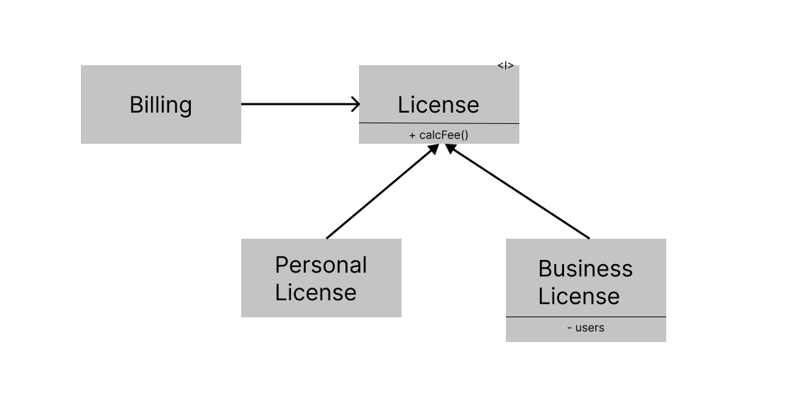
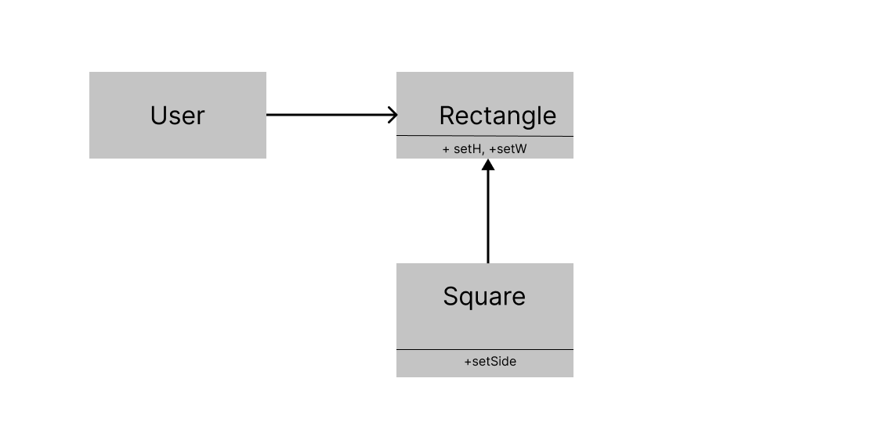

# LSP(Liskov Substitution Principle)

1998년 바바라 리스코프는 하위 타입을 아래와 같이 정의했다.

> S 타입의 객체 o1 각각에 대응하는 T 타입 객체 o2가 있고, T타입을 이용해서 정의한 모든 프로그램 P에서 o2의 자리에 o1을 치환하더라도 P의 행위가 변하지 않는다면, S는 T의 하위 타입이다.

즉 상위클래스와 하위 클래스의 행위에는 일관성이 존재해야 한다는 의미이다. 상위클래스가 사용되는 지점에서 하위클래스를 사용해도 대체 가능하다라는 의미인데 잘 와닿지는 않는다. 몇가지 예제를 통해 이 개념을 구체화해보자.


## 상속을 사용하도록 가이드하기



위와 같이 License 라는 클래스에는 calcFee()라는 메서드를 가지며, Billing 애플리케이션에서 이 메서드를 호출한다. License에는 PersonalLicense와 BusinessLicense라는 두 가지 ‘하위 타입'이 존재한다. 이들 두 하위 타입은 서로 다른 알고리즘을 이용해서 라이선스 비용을 계산한다.

위 설계가 LSP를 준수하는 이유는 Billing 애플리케이션의 행위가 License하위 타입 중 무엇을 사용하는지에 전혀 의존하지 않기 때문에 모두 License타입을 치환할 수 있다.


## 정사각형/직사각형 문제

LSP를 위반하는 가장 유명한 문제이다. 흔히들 정사각형은 직사각형의 개념안에 포함되는 관계이므로 상속을 사용할 수 있다고 생각한다. 하지만 대체로 이는 성립하지 않는다.



위 예제에서는 무엇이 문제가 될까?  rectangle의 가로와 세로길이를 정의하고, 넓이를 구하는 로직을 짠다고 해보자.

```jsx
class Rectangle{

	constructor(width,height){
		this.width = width;
		this.height = height;
	}

	set W(length:number){
		this.width = length;
	}

	set H(length:number){
		this.heigth = length;
	}

	get area(){
		return this.width * this.height;
	}
}

class Square extends Rectangle{
	constructor(width,height){
		super(width,height)
	}

	set side(length:number){
		this.width = length;
		this.height = length;
	}

	set W(length:number){
		this.side = length;
	}

	set H(length:number){
		this.side = length;
	}
}

const rec = new Rectangle(3, 4);
rec.W = 3;
rec.H = 5;
console.log(rec.area);  //15;

const sqr = new Square(3, 4);
sqr.W = 3;
sqr.H = 5;
console.log(rec.area);  //25;
```

위와 같이 서브타입 클래스 Square와 수퍼타입 Rectangle은 각기 다른 결과를 가져온다. 정사각형의 set W는 가로와 세로길이를 모두 변경하기 때문이다. 이는 Square가 Rectangle을 대체할 수 없음을 나타내고 이는 리스코프 치환원칙에 위반되는 결과를 가져온다.

그렇다면 위 로직에서 리스코프 치환원칙은 준수하게 하려면 어떻게 해야 할까?

```jsx
interface Shape {
  area(): number;
}

class Rectangle implements Shape {
  constructor(width: number, height: number) {
    this.width = width;
    this.height = height;
  }

  set W(width: number): void {
    this.width = width;
  }

  set H(height: number): void {
    this.height = height;
  }

  public area(): number {
    return this.width * this.height;
  }
}

class Square implements Shape {
   #side: number;

  constructor(side: number) {
    this.#side = side;
  }

  setSide(side: number): void {
    this.#side = side;
  }

  area(): number {
    return this.side * this.side;
  }
}

const rec: Shape = new Rectangle(2, 8);
rec.area() === 16; // true

const sq: Shape = new Square(5);
sq.area() === 25; // true
```

LSP가 지켜지지 않았다는 것은 상속관계가 잘못되어있다는 말이다. setWidth,와 setHeight가 다르게 동작하기 때문에 상속관계로 구현할 수 없다. 따라서 상속관계를 제거하고 새로운 super타입인 square 인터페이스를 만들고 이를 상속받도록 구현해야한다. 이렇게 한다면 shape는 각기 다른 서브타입인 rectangle과 square를 가지고 shape내의 get area는 동작방식이 없는 인터페이스의 메소드일 뿐이므로 rectangle과 square로 대체가 가능하다.


## LSP와 아키텍처

객체지향의 초창기에는 LSP는 상속을 사용하도록 가이드하는 방법 정도로 간주되었다. 하지만 시간이 지나면서 LSP는 인터페이스와 구현체에도 적용되는 더 광범위한 소프트웨어 설계 원칙으로 변모해왔다.

하지만 LSP는 이를 뛰어넘어 아키텍처 관점에서도 적용할 수 있다. 잘 정의된 인터페이스와 그 인터페이스의 구현체끼리의 상호 치환 가능성에 기대는 사용자들이 존재하기 때문이다.

기능이나 시스템의 확장에 있어서 치환 가능성은 중요한 키워드이다. 새롭게 추가된 기능이 정해진 슈퍼타입의 알고리즘을 벗어나거나 반환값의 타입이 달라지는 등 오염된 객체가 추가된다면 이를 사용하는 쪽에서는 이에 대한 대응을 위한 로직을 추가해야 한다. 이로 인해 코드의 복잡성은 증가하고 결국엔 OCP또한 위반하게 된다. 따라서 LSP는 상위타입을 하위타입이 대체할 수 있음 즉 치환가능성을 항상 고려해야한다는 의미다.