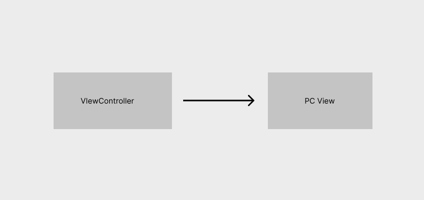
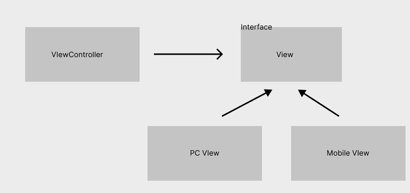
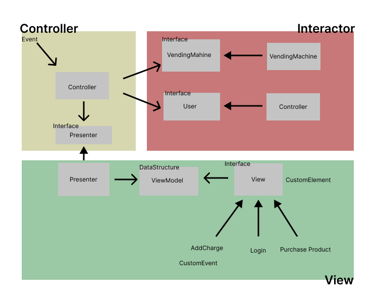
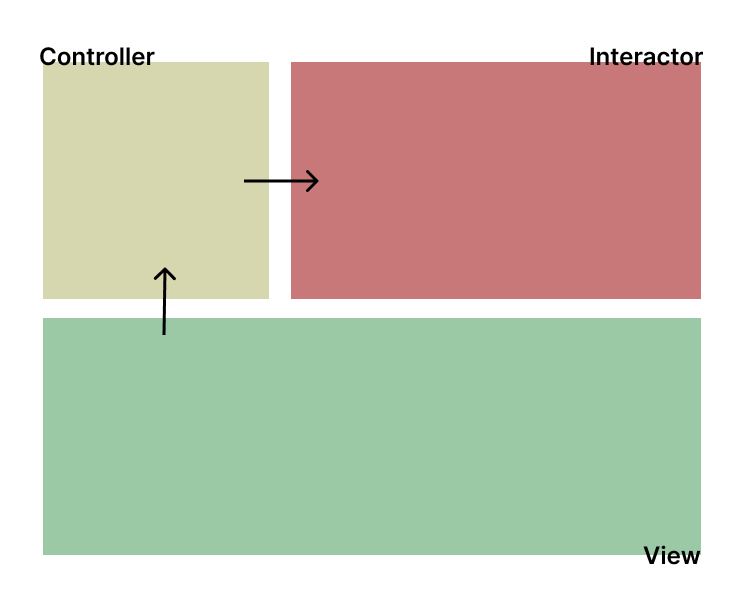

# OCP(Open-Closed Principle)

> 소프트웨어 개체(artifact)는 확장에는 열려 있어야 하고, 변경에는 닫혀 있어야 한다.

다시 말해 소프트웨어 개체의 행위는 확장할 수 있어야 하지만, 이때 개체를 변경해서는 안 된다. 소프트웨어 아키텍처를 공부하는 가장 근본적인 이유가 바로 이 때문이다. 요구사항을 살짝 확장하는 데 소프트웨어를 엄청나게 수정해야 한다면, 그 소프트웨어 시스템을 설계한 아키텍트는 엄청난 실패에 맞닥뜨린 것이다.

아키텍처 컴포넌트 수준에서 OCP를 고려할 때 훨씬 중요한 의미를 가진다.

## 예제)

가장 간단한 예는 다음과 같다.

PC의 뷰만을 지원하는 애플리케이션이 있다고 가정하자. 만약에 모바일에 대한 확장요청이 들어오면 어떻게 될까?

View를 제어하는 controller가 직접적으로 PC View를 참조하고 있기 때문에 Mobile View 객체가 들어온다면 Controller에서 Moblie에 관련된 로직이 추가될 수 밖에 없어 기능의 추가가 Controller에게도 직접적인 영향을 끼치게 된다. 위는 아주 간단한 구조이지만 확장상황에서 모든 객체의 로직이 변경되는 상황이 발생한다.

 이와 같은 상황일 때 확장에 유연하게 대처하려면 어떻게 아키텍처를 구성해야 할까? 후에 다시 설명하겠지만 의존성 역전 원칙(DIP)을 사용하는 것이 하나의 방법이 될 수도 있다. ViewController와 PC View 사이에 인터페이스를 추가함으로써 View Controller는 직접적인 PCVIew의 메소드 내용을 몰라도 가능하다 따라서 Mobile View가 추가되더라도 View Controller의 로직은 바뀌는게 거의 없을 것이다.

 PC View와 거의 로직이 동일하다는 가정하에 위 애플리케이션에서 Moblie확장 요청이 들어온다 하더라도 MoblieView 객체만 추가해주면 되기때문에 훨씬 간단하다. 이것이 확장에 열려있고 변경에 닫혀있는 가장 단순한 예 중 하나로 여겨진다.

위의 상황은 단순히 객체와 객체간의 관계를 통해 OCP를 증명하였다. OCP의 진가는 컴포넌트와 컴포넌트 사이 즉 계층간에서도 빛을 발한다.

*위 예시는 OCP를 읽고 MVC와 유사한 제마음대로 이름붙인 구조이니 명칭과 관련해서는 유도리 있게 읽어주셨으면 좋겠습니다!*

이 전의 예시를 통해 추가적인 View가 들어왔을 때 OCP가 힘을 발휘한다는 것은 증명되었다. OCP가 위력을 발휘하는 것은 레이어 간의 관계에도 있다. 그렇다면 객체를 제외한 레이어간의 관계만을 살펴보자.

 주목할 사항은 모두 단방향으로 이루어져있다는 것이다. 이들 화살표는 변경으로부터 보호하려는 컴포넌트를 향하도록 그려진다. A컴포넌트에서 발생한 변경으로부터 B 컴포넌트를 보호하려면 반드시 A 컴포넌트가 B 컴포넌트에 의존해야 한다. View에서 발생한 변경으로부터 Controller를 보호하고 Interactor는 모든 부분의 변경에서 보호해야 한다. 위 구조에서 가장 중요한 레이어는 어디라고 생각하는가? 내가 생각하기에는 중요 정보 및 규칙 즉 데이터를 가공하고 관리하는 로직이 담겨있는 Interator 레이어라고 생각한다. 때문에 Interactor는 보호 계층 구조가 가장 높게 설계해야 한다.

 Interactor는 가장 높은 수준의 개념이며, 따라서 최고의 보호를 받는다. View는 가장 낮은 수준의 개념 중 하나이며, 따라서 거의 보호를 받지 못한다. 이것이 바로 아키텍처 수준에서 OCP가 동작하는 방식이다. 아키텍트는 기능이 어떻게, 왜, 언제 발생하는지에 따라서 기능을 분리하고, 분리한 기능을 컴포넌트의 계층구조로 조직화 한다. 컴포넌트 계층구조를 이와 같이 조직화하면 저수준 컴포넌트에서 발생한 변경으로부터 고수준 컴포넌트를 보호할 수 있다.

 동시에 인터페이스를 통해 계층간의 의존성을 낮춰서 정보은닉을 가능케한다. Controller에서 발생한 변경으로부터 Interactor를 보호하는 일의 우선순위가 가장 높지만, 반대로 Interactor에서 발생한 변경으로부터 Controller도 보호되기를 바란다. 이를 위해 Interactor 내부를 은닉한다.

## 결론

OCP의 목표는 시스템을 확장하기 쉬운 동시에 변경으로 인해 시스템이 너무 많은 영향을 받지 않도록 하는데 있다. 이러한 목표를 달성하려면 시스템을 컴포넌트 단위로 분리하고, 저수준 컴포넌트에서 발생한 변경으로부터 고수준 컴포넌트를 보호할 수 있는 형태의 의존성 게층 구조가 만들어지도록 해야한다.

