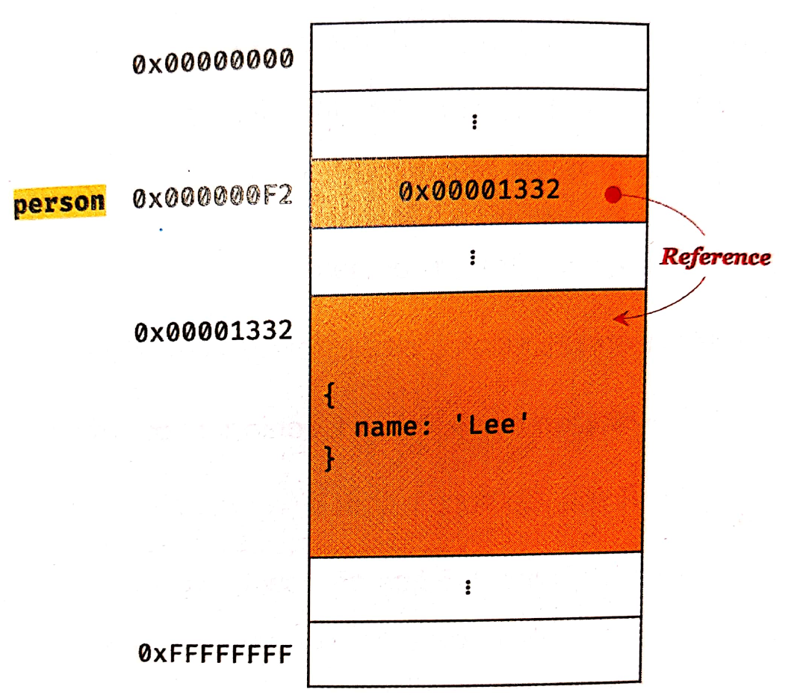

# 원시값과 객체의 비교

## 원시 값과 객체의 비교

- 원시 타입의 값, 즉 원시값은 변경 불가능한 값이다. 이에 비해 객체 타입의 값, 즉 객체는 변경 가능한 값이다.
- 원시값을 변수에 할당하면 변수에는 실제값이 저장된다. 이에 비해 객체를 변수에 할당하면 변수에는 참조 값이 저장된다.

---

## 원시값

변경할수 없는것은 변수가 아니라 값에 대한 진술이다.

변수를 재할당할때마다 메모리공간의 주소가 변경된 이유는 원시값이 변경 불가능한 값이기 때문이다.

---

## 유사 배열 객체

유사 배열 갹채란 마치 배열처럼 인덱스로 프로퍼티에 접근할수 있고 length 프로퍼티를 갖는 객체를 말한다.

```jsx
var string = "string";

string[0] = "S";

console.log(string); // string
```

문자열은 원시값이기에 string[0]로 접근하여 값을 바꿔도 값이 변하지 않는다.

- 값은 메모리공간에 저장되고 식별자는 메모리의 주소를 저장한다.

---

## 객체

객체는 프로퍼티의 수가 정해져있지 않으며 동적으로 추가하고 삭제가 가능하다. 따라서 원시값과 같이 메모리 공간의 크기를 사전에 결정할수 없다.

원시값은 상대적으로 적은 메모리를 소비하지만 객체는 경우에 따라 크기가 매우 클수도 있다. 따라서 객체는 원시값과 다른 방식으로 동작을 한다.

- 자바나 C++같은 객체지향 언어는 사전에 정의된 클래스를 기반으로 객체를 생성한다. 객체가 생성된 이후라도 동적으로 프로퍼티를 추가 혹은 삭제할수 없다.

- 자바스크립트는 동적으로 프로퍼티를 추가혹은 삭제가 가능하여 매우 편리하지만 성능면으로 비용이 많이 드는 비효율적인 방식이다.

- 따라서 js엔진은 프로퍼티에 접근하기위해 동적탐색대신 히든 클래스라는 방식을 사용하여 C++에 해당하는 성능을 보인다.

[https://ui.toast.com/weekly-pick/ko_20210909](https://ui.toast.com/weekly-pick/ko_20210909) - 다음은 히든클래스에 대한 설명이다.



이런식으로 객체를 할당한 변수를 참조하면 메모리에 저장되어있는 참조값을 통하여 객체에 접근한다.

원시값을 갖는 변수는 변경할수없어서 재할당을 해야하지만 객체는 재할당없이 직접적으로 변경가능하다.

객체는 복사하여 생성하는 비용이 많이 들기에 성능을 향상시키기위해 객체는 변경가능한 값으로 설계되어있다.

- 부작용: 여러개의 식별자가 하나의 객체를 공유할수 있다는점이다.

참조에 의한 전달, 스프레드 문법을 이용하면 여러개의 식별자가 같은 객체를 공유할수가 있다..

```jsx
var person = {
  name: "LEE",
};

var copy = person;
```

---

## 값에 의한 전달, 참조에 의한 전달

결국 값에의한 전달과 참조에 의한 전달은 식별자가 기억하는 메모리 공간에 저장되어 있는 값을 복사해서 전달한다는 면에서 동일하다. → 공유의 의한 전달이라고 부른다.
