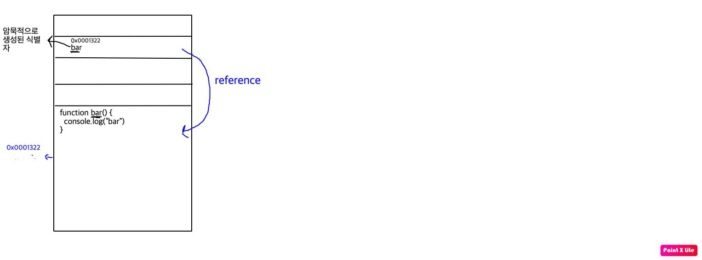

# 함수

프로그래밍 언어의 함수는 일련의 과정을 문으로 구현하고 코드블록으로 감싸서 하나의 실행단위로 정의한것이다.

---

## 함수를 사용하는 이유

- 코드의 재사용
- 유지보수의 편의성, 코드의 신뢰성
- 코드의 가독성

---

## 함수 리터럴

자바스크립트는 함수도 객체 타입의 값이다. 함수 리터럴은 `function`, `함수 이름`, `매개변수 목록`, `함수 몸체`로 구성된다.

- ### 함수 이름
  - 함수 이름은 식별자이므로 식별자 네이밍 규칙을 준수해야함
  - 함수 이름은 함수 몸체 내에서만 참조할수 있는 식별자이다.
  - 함수 이름은 생략이 가능하다. 이름이 있다면 기명함수, 이름이 없다면 무명함수라고 한다.
- ### 매개변수 목록
  - 0개 이상의 매개변수를 소괄호로 감싸고 쉼표로 구분한다.
  - 각 매개변수에는 함수를 호출할때 지정한 순서대로 할당 -> 순서를 맞춰서 해야함
  - 매개변수도 식별자 네이밍 규칙을 준수 해야함
- ### 함수 몸체
  - 함수가 호출되었을때 일괄적으로 실행될 문들을 하나의 실행 단위로 정의된 코드블록이다.
  - 함수 몸체는 함수 호출에 의해 실행된다.

> 함수 리터럴도 평가되어 값을 생성하며, 이 값은 객체이다. 즉 함수는 객체다.
> 함수는 객체이지만 일반 객체와는 다르게 함수는 `호출`이 가능하다.
> -> ch18(함수와 일급객체)에서 자세히 다룰 예정

---

## 함수 정의

함수 정의란 함수를 호출하기 이전에 인수를 전달받을 매개변수와 문들, 반환할 값을 지정하는것을 말한다.

### 함수 선언문

```jsx
function add(x, y) {
  return x + y;
}
```

함수 선언문은 함수이름을 생략할수 없으며 `표현식이 아닌 문`이기에 값을 평가하여 return하지않는다.
`표현식이 아닌 문`은 변수에 할당할수 없다.

```jsx
var add = function add(x, y) {
  return x + y;
};

console.log(add(2, 5)); //7
```

이렇게 작동이 되는이유는 `{ }`을 자바스크립트 엔진이 코드의 문맥에 따라 `블록문`, `객체 리터럴` 2개로 해석할수 있기 때문이다. `{ }`이 단독으로 존재하면 자바스크립트 엔진은 이것을 `블록문`으로 해석한다.

하지만 `{ }`이 평가되어야되는 문맥에서 피연산자로 이용되면 `{ }`를 `객체 리터럴`로 해석한다.

역시 기명 함수 리터럴도 중의적인 코드가 될수있다. 함수 리터럴을 단독으로 이용하면 `함수 선언문`, 피연산자로 이용하게 된다면 `함수 리터럴 표현식`으로 해석한다.

추가적으로 함수 선언문은 생성된 함수를 호출하기 위해 함수이름과 동일한 이름의 식별자를 암묵적으로 생성한뒤,거기에 객체를 할당한다.



### 함수 표현식

```jsx
var add = function (x, y) {
  return x + y;
};
```

자바스크립트의 함수는 값처럼 변수에 할당이 가능하고, 프로퍼티 값이 될수도 있으며, 배열의 요소가 될수도 있다. 이와 같은 `값의 성질`을 가지고 있는것을 `일급 객체`라고 하며 자바스크립트의 함수는 일급 객체이다.

함수는 일급 객체이므로 함수 리터럴로 생성한 함수 객체를 변수에 할당을 할수가 있다.

```jsx
var add = function foo(x, y) {
  return x + y;
};

console.log(add(2, 5)); //7

console.log(foo(2, 5));
```

이런식으로 작성했을때 `foo`함수에서는 어떤 값이 나올까? 함수 선언문에서 배웠던 식으로 foo가 암묵적으로 식별자가 되어 foo함수를 가르킬까?

아니다. 위의 선언문에서 설명했듯이 함수 리터럴에는 중의적인 의미가 있는데 우변에 피연산자로 함수 리터럴을 이용할시에는 함수 표현식으로 해석을 한다는것이다. 그러므로 사실상 저것은 기명함수지만 익명함수와 동일하다고 생각하면 된다. 값을 return을 하지만 저것자체로 선언을 하지않아 foo를 불러오면 `ReferenceError`를 불러온다.

### Function 생성자 함수

```jsx
var add = new Function("x", "y", "return x + y");
```

자바스크립트가 기본 제공하는 빌트인 함수인 `Function` 생성자 함수에 매개변수 목록과 함수의 몸체를 문자열로 전달하여 new를 사용하여 작성한다.

`별로 바람직한 방법`은 아니며 선언문이나 표현식으로 생성한 함수와 다르게 동작을 한다.

Function은 클로저를 생성하지않으며 선언문과 표현식은 클로저를 생성한다는 차이가 있다.

### 화살표 함수

```jsx
var add = (x, y) => x + y;
```

화살표 함수는 기존 함수와 this바인딩에 다르고 prototype프로퍼티가 없으며 arguments객체를 생성하지않는다.

이내용은 뒤에 나오는 this, arguments,prototype을 배우고 26.3절의 화살표함수 파트에서 좀더 자세히 다루도록 하겠다.

> 변수는 `선언`한다고 했지만 함수는 `정의`라고 되어있다. 함수 선언문이 평가되면 식별자가 암묵적으로 생성되고 함수 객체가 할당된다.

---

## 함수 생성 시점과 함수 호이스팅

### 함수 선언문

`함수 선언문`으로 정의한 함수와 함수 표현식으로 정의한 함수는 생성시점이 다르다.

모든 선언문과 동일하게 함수 선언문 역시 런타임 이전에 자바스크립트 엔진에 의하여 먼저 실행이 된다. 그래서 함수 이름과 동일한 이름의 식별자를 생성하고 함수객체를 할당을 한다.

이렇게 함수선언문이 코드의 가장 위로 끌어올려진것처럼 동작하는것을 `함수 호이스팅`이라고 한다.

### 변수 호이스팅과의 차이?🍎

그렇다면 이런 `함수 호이스팅`과 `변수 호이스팅`의 차이는 뭘까?

var키워드를 이용하여 변수를 선언한후 값의 할당전에 변수를 불러낸다면 `Error`대신 `undefined`를 내보낼것이다.

하지만 함수의 경우는 선언을 하면 암묵적으로 식별자가 생기며 바로 함수객체를 가르키기에 선언문 이전에 호출해도 함수가 정상적으로 호출이 가능하다.

### 함수 표현식

`함수 표현식`은 변수에 할당되는 값이 함수 리터럴인 `문`이다.

`함수 표현식`을 이용하면 런타임 이전에 할당받는 변수가 먼저 선언이 되며 `undefined`로 초기화되고 런타임때 함수를 할당하는 코드를 만나여 변수에 `function`이 들어가게 된다.

즉 함수 표현식을 사용시에는 `함수 호이스팅`이 아닌 `변수 호이스팅`이 발생한다.

---

## 함수 호출

함수는 함수를 가르키는 식별자와 한쌍의 소괄호를 이용하여 호출을 할수 있다.

### 매개변수와 인수

함수를 실행하기 위해 필요한값을 함수 외부에서 함수 내부로 전달해야되는 경우 매개변수를 통해 인수를 전달한다.

```jsx
function add(x, y) {
  //매개변수를 통하여 받기
  return x + y;
}

var result = add(2, 5); // 인수를 전달
```

매개변수의 스코프는 함수 내부이기에 함수 외부에서는 참조를 할수 없다.

그리고 함수는 매개변수의 갯수를 체크하지않으며 인수가 부족하더라도 에러대신에 undefined가 들어가게 된다.

### 인수확인

```jsx
function add(x, y) {
  return x + y;
}

console.log(add(2));
console.log(add("a", "b"));
```

이런경우에서도 에러없이 실행은 되기에 예측못한값이 나올수가 있다. 그래서 자바스크립트는 함수를 정의할때 인자가 올바르게 들어갔는지 확인을 할필요가 있다.

```jsx
function add(x, y) {
  if (typeof x !== "number" || typeof y !== "number") {
    throw new Error("인수는 모두 숫자값이여야합니다");
  }

  return x + y;
}
```

> ## 매개변수 기본값
>
> ```jsx
> function add(a = 0, b = 0, c = 0) {
>   return x + y + z;
> }
> console.log(add(1, 2)); // 3
> ```
>
> es6에 새로 도입된 문법이며 매개변수에 인수를 전달하지않거나 undefined를 전달할 경우 이용가능하다.

### 매개변수의 최대갯수

ECMAscript에서는 매개변수의 최대갯수를 명시적으로 제한하지 않고 있다. 매개변수는 최대 몇개정도를 사용하는것이 좋을까??

매개변수에는 순서에 의미가 있기에 매개변수가 많아질수록 호출할때 인수의 순서를 고려하며 해야하기에 이해하기 어렵고 실수를 할 가능성을 높인다. -> 유지보수가 나쁘다.

매개변수의 이상적인 갯수는 `0개`이며 적을수록 좋다. 그리고 매개변수가 많다는것은 함수가 여러가지일을 한다는 증거이기에 바람직하지않다.

그래서 최대 매개변수는 `3개`를 넘지않을것을 권장하고 있다.

> 인수로 객체를 주게 된다면 인수의 순서를 신경쓰지 않아도 되지만 함수 외부의 객체가 변경될수 있는 side-effect가 발생할수 있다는것이다.

### 반환문

함수는 return 키워드와 반환값(표현식)으로 이루어진 반환문을 이용하여 실행결과를 반환할수 있다.

return은 두가지 역할을 한다.

- 함수의 실행을 중단하고 함수를 빠져나간다.
- return 뒤에 오는 표현식을 평가하여 반환한다.

## 참조에 의한 전달과 외부 상태의 변경

원시값을 인수로 전달하여 매개변수로 받으면 그 값을 변경하여도 원본의 값은 변하지않는다.

하지만 객체 타입의 인수는 참조값이 복사가 되어 매개변수에 전달되기 때문에 함수 몸체에서 참조값을 통해 객체를 변경할 경우 원본이 훼손이 된다.

이러한 문제의 해결법은 객체를 원시값처럼 변경 불가능한 값으로 동작하게 만드는것이다. 이를 통해 객체의 상태변경을 원천봉쇄하고 상태변경이 필요한 경우에는 `깊은 복사`를 통해 새로운 객체를 생성하여 해결한다.

## 다양한 함수의 형태

### 1. 즉시 실행 함수

함수 정의와 동시에 즉시 실행되는 함수를 즉시 실행 함수라고 한다. 즉 단 한번만 호출가능하며 다시 호출할수가 없다.

```jsx
(function () {
  var a = 3;
  var b = 5;
  return a + b;
})();
```

```jsx
  function () {
    var a = 3;
    var b = 5;
    return a + b;
  }()
```

이렇게 하면 오류가 나오는데 이유가 뭘까? 이것은 함수 선언문의 형태이기 때문에 이름을 생략할수 없기때문에 `함수 이름이 없다는 오류`가 나온다.

```jsx
  function foo() {
    var a = 3;
    var b = 5;
    return a + b;
  }()
```

그렇다면 이것은 될까? 이것역시 되지않는다. 함수 선언문에서는 `{ }`를 코드 블록으로 해석하기에 `자바스크립트의 세미콜론 자동삽입기능`으로 `{ }`뒤에 세미콜론이 붙고 그 뒤에 `()`가 붙기에 `unexpected token ')'` 이 나올것이다.

> ```jsx
> function foo(){};();
> ```
>
> 이것과 동일하게 실행된다.

그래서 그룹연산자의 피연산자는 값으로 평가되기에 무명함수를 그룹연산자로 감싸면 함수리터럴로 평가되어 함수객체가 된다.

### 2. 재귀함수

자기 자신을 호출하는 함수이다.

### 3. 중첩 함수

함수 내부에 중첩된 함수를 `중첩 함수` 혹은 `내부 함수`라고 부른다. `중첩함수`를 포함하는 함수는 `외부함수`라고 부른다.`중첩함수`는 외`부함수` 내부에서만 호출이 가능하다.

일반적으로 중첩함수는 외부함수를 돕는 `헬퍼 함수`의 역할을 한다.

```jsx
function outer() {
  var x = 1;

  function inner() {
    var y = 2;
    console.log(x + y);
  }

  inner();
}
```

### 콜백 함수

함수의 매개변수를 통해 다른 함수의 내부로 전달되는 함수를 콜백 함수라고 하며, 매개변수를 통해 함수의 외부에서 콜백함수를 전달받은 함수를 고차함수라고 한다.

콜백함수도 중첩함수와 마찬가지로 고차함수에 전달되어 헬퍼 함수 역할을 한다. 중첩함수는 내부의 함수가 고정되어 있지만 고차함수는 콜백에 따라 바꿀수 있는 자유도가 있다.

고차 함수는 매개변수를 통해 전달받은 콜백 함수의 호출시점을 결정하여 호출한다. 즉, 콜백 함수는 고차 함수에 의해 호출되며 이때 고차함수는 필요에 따라 콜백함수에 인수를 전달할수 있다.`따라서 고차 함수에 콜백함수를 전달할때는 호출을 하지않고 함수 자체를 전달해야한다.`

### 순수 함수와 비 순수 함수

함수형 프로그래밍에서 어떤 외부 상태에 의존하지도 않고 변경하지도 않는, 즉 사이드 이펙트가 없는 함수를 순수함수, 외부상태에 의존하거나 변경한다면 비순수함수라고 부른다.

순수함수는 동일한 인수가 전달되면 항상 동일한 값을 반환을 하는 함수다.

반대로 비순수함수는 함수의 외부상태를 변경을하는 부수효과가 있고 외부상태에 따라 반환하는 값이 달라진다.

```jsx
var count = 0;

function increase(n) {
  return n++;
} //순수 함수

function increase() {
  return count++;
} // 비순수 함수
```

함수가 외부 상태를 변경하면 상태변화를 추적하기가 어려워 지기에 함수 외부상태 변경을 하지않는 순수함수를 사용하는것이 좋다.
