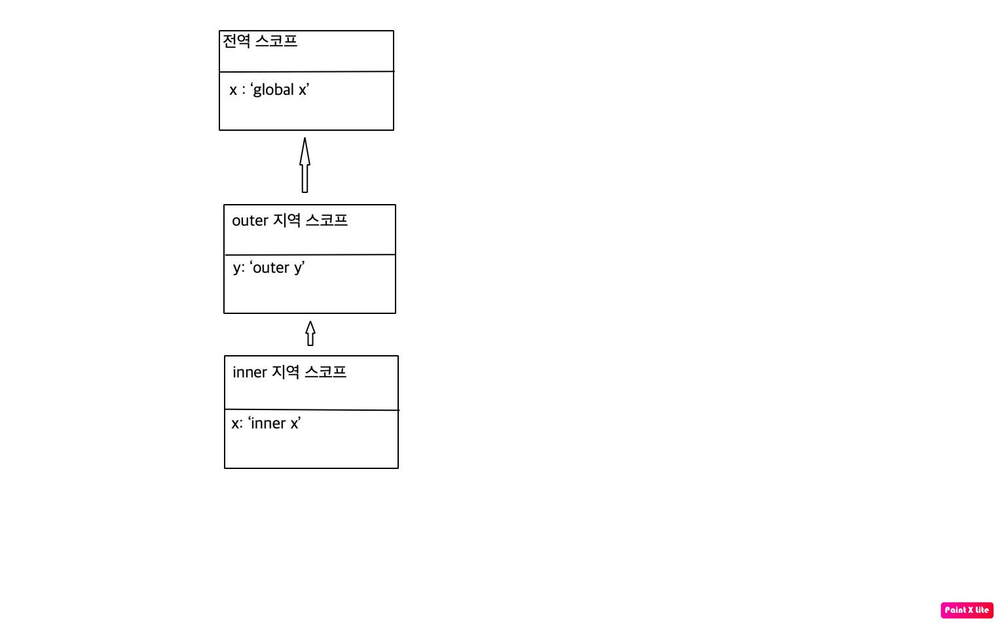

# 스코프

변수는 코드의 가장 바깥 영역뿐만 아니라 코드 블록이나 함수 몸체 내에서도 선언할수 있다. 이떄 코드블록이나 함수는 중첩될수 있다.

```jsx
function add(x, y) {
  console.log(x, y); // 함수 내부에서만 매개변수를 참조 가능
  return x + y;
}

add(2, 5);
console.log(x, y); // Reference Error
```

---

변수는 자신이 선언된 위치에 의해 자신이 유효한 범위, 즉 다른 코드가 변수 자신을 참조할수 있는 범위가 결정된다.

변수뿐만 아니라 모든 식별자가 그렇게 작동을한다.

**모든 식별자는 자신이 선언된 위치에 의해 다른코드가 식별자 자신을 참조할수 있는 유효범위가 결정된다. 이것을 우리는 스코프라고 하며 스코프는 식별자가 유효한 범위를 말한다.**

```jsx
var x = "global";

function foo() {
  var x = "local";
  console.log(x);
}

foo();
console.log(x); // ?
```

자바스크립트는 이름이 같은 2개의 변수중에 어떤것을 참조해야하는지 결정한다. 이것을 **식별자 결정** 이라고 한다.

자바스크립트 엔진은 스코프를 통해 어떤 변수를 참조할것인지를 결정한다. 따라서 스코프는 자바스크립트 엔진이 **식별자를 검색할때 사용하는 규칙** 이라고도 할수있다.

- 스코프는 실행컨텍스트와 깊은관련이 있다. ch23에서 좀더 자세히 알아볼것이다.

위의 코드에서 전역으로 선언한 x는 어디서든 참조할수 있고 함수 내부에서 생성된 x는 함수 외부에서 참조할수가 없다. 이때 2개의 x변수는 식별자 이름이 동일하지만 자신이 유효한 범위, 즉 스코프가 다른 별개의 변수이다.

스코프란 개념이 없으면 같은 이름의 변수는 충돌을 일으키기에 프로그램 전체에서 하나만 쓸수 있다.

식별자는 어떤 값을 구별해낼수있는 유일한 이름을 말한다. 그래서 식별자는 유일해야한다.

따라서 식별자인 변수이름은 중복될수없으며 반드시 하나의 값에 연결 되어있어야한다.

**즉 스코프는 네임스페이스이다.**

## 스코프의 종류

코드는 전역과 지역으로 구분할수 있다.

- 전역: 코드의 가장 바깥 영역
- 지역: 함수 몸체 내부

### 전역 스코프

전역이란 코드의 가장 바깥영역을 말하며 전역은 전역 스코프를 만든다. 전역에 변수를 선언하면 전역 스코프를 가진 전역 변수가 생성된다.

**전역변수는 어디서든지 참조할수 있다.**

### 지역 스코프

지역이란 **함수 몸체 내부**를 말한다.

지역변수는 자신이 선언된 지역과 하위지역에서만 참조를 가능하다. **즉, 지역변수는 자신의 지역 스코프와 하위지역 스코프에서 유효하다.**

```jsx
var x = "global x";

function outer() {
  var y = "outer y";

  function inner() {
    var x = "inner x";
    console.log(x);
  }
}
```

이런식으로 있다면 콘솔에서는 전역인 x도 지역인 x도 참조할수 있다. 그러면 어떤값이 나오게 될까?

정답은 'inner x'이다. 이는 자바스크립트 엔진이 **스코프 체인**을 통해 참조할 변수를 검색했기 때문이다.

## 스코프 체인

함수는 중첩이 될수가 있다. 즉 함수의 지역스코프도 중첩될수 있다는것이다. 이는 **스코프가 함수의 중첩에 의해 계층적 구조를 갖는다**는 것을 의미한다. 다시 말해 중첩함수의 지역스코프는 중첩함수를 포함하는 외부함수의 지역스코프와 계층적 구조를 갖는다. 이떄 외부함수의 지역스코프를 중첩함수의 **상위 스코프**라고 한다.



이런식으로 모든 스코프는 하나의 계층적 구조로 연결이 되며 이것을 **스코프 체인** 이라고 한다.

### 검색과정

변수를 참조할때 자바스크립트 엔진은 스코프 체인을 통해 변수를 참조하는 코드의 스코프에서 시작하여 상위 스코프 방향으로 이동하며 선언된 변수를 **검색** 한다.

이 스코프 체인은 물리적인 실체로 존재한다. 저런 그림의 모양과 유사하게 `렉시컬 환경`을 생성한다.

변수 선언 실행시 변수 식별자가 이 `렉시컬 환경`에 **키**로 들어가고 할당이 일어나면 자료구조의 변수 식별자에 해당하는 값을 변경한다. 변수의 검색도 이곳에서 일어난다.

> 함수를 탐색할때도 동일한 방식으로 이루어지는데, 변수를 탐색한다기보다 **식별자**를 탐색한다고 생각하면 된다.

## 함수 레벨 스코프

지역은 함수 몸체 내부를 말하고 지역은 지역스코프를 만든다고 했다.

이는 `코드 블록`이 아닌 `함수`에 의해서 지역 스코프가 생성된다는 것이다.

C나 자바등을 비롯한 대부분의 프로그래밍언어는 `함수 몸체`뿐만 아니라 `코드 블록(if, while, for, try/catch)` 등에서도 지역 스코프를 만든다. 이러한 특성을 **블록 레벨 스코프**라고 한다.

하지만 **var 키워드로 선언된 변수는 오로지 `함수의 코드블록`만을 지역 스코프로 인정한다**

## 렉시컬 스코프

```jsx
var x = 1;

function foo() {
  var x = 10;
  bar();
}

function bar() {
  console.log(x);
}

foo();
bar();
```

위 함수의 실행결과는 bar 함수의 상위스코프가 무엇인지에 따라 결정된다.

과연 어떤 패턴으로 결정이 될까?

- **함수가 어디서 호출되었는지**에 따라 함수의 상위 스코프를 결정한다.
- **함수를 어디서 정의**했는지에 따라 함수의 상위 스코프를 결정한다.

만약 첫번째 방식으로 상위 스코프를 결정한다면 `bar함수`의 상위스코프는 `foo함수`와 `전역 스코프`가 될것이다.

만약 두번째 방식이라면 상위스코프는 `전역 스코프`를 결정한다.

프로그래밍 언어는 일반적으로 이 2가지 패턴중 하나로 상위스코프를 결정한다.

**첫번째 방식**을 `동적 스코프`라고 한다.
**두번째 방식**을 `렉시컬 스코프` 또는 `정적 스코프`라고 한다. 자바스크립트를 포함한 대부분의 프로그래밍 언어는 `렉시컬 스코프`라고 한다.

자바스크립트는 `렉시컬 스코프`를 따르기에 호출된 위치는 상위 스코프 결정에 어떠한 영향도 주지 않는다. 즉 함수의 상위 스코프는 언제나 자신이 정의된 스코프이다.

즉 저 예시에서는 bar은 선언과 동시에 상위스코프가 전역으로 설정되고 실행을 하면 1이 2번 콘솔에 나온다.

`렉시컬 스코프`는 클로저와 깊은관련이 있다. 이에 대해서는 24장 클로저에 대해 자세히 알아보자!
