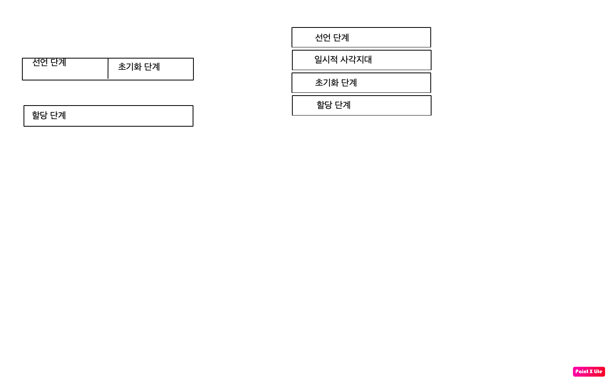

# let, const 키워드와 블록 레벨 스코프

## var키워드로 선언한 변수의 문제점

### 변수 중복 선언 허용

var 키워드로 선언한 변수는 중복 선언이 가능하다.

```jsx
var x = 1;
var y = 1;

var x = 100; // 초기화문이 있는 변수선언문은 자바스크립트에 인해 var이 없는것처럼 동작한다.
var y; // 초기화문이 없는것은 무시!

console.log(x); //100
console.log(y); //1
```

### 함수 레벨 스코프

var 키워드로 선언한 변수는 오로지 함수의 코드 블록만을 지역변수로 설정한다.

```jsx
var x = 1;

if (true) {
  var x = 10;
}

console.log(x); //10
```

if는 함수가 아니기에 var x = 10이 전역으로 처리되어 10이 나오는 모습이다.

### 변수 호이스팅

var키워드로 변수 선언시 변수 호이스팅에 인해 변수 선언문이 스코프의 선두로 끌어올려진것처럼 동작한다.

```jsx
console.log(foo); //undefined

foo = 123;

console.log(foo); //123

var foo;
```

`var foo;` 가 런타임 이전에 먼저 실행되어 undefined로 초기화되어 콘솔에 찍히고 그 다음에 123을 할당한다.

## let 키워드

### 변수 중복 선언 금지

let 키워드로 중복선언을 하면 `Syntax Error`가 나온다.

### 블록 레벨 스코프

let키워드로 선언한 변수는 if, for, while, try/catch를 지역스코프로 인정하는 블록스코프를 따른다.

```jsx
let foo = 1; //전역 변수
{
  let foo = 2; //지역 변수
  let bar = 3; //지역 변수
}
console.log(foo); //1
console.log(bar); //ReferenceError
```

### 변수 호이스팅

let키워드는 var과 다르게 변수 호이스팅이 발생하지 않는다.

```jsx
console.log(foo); // ReferenceError
var foo;
```

var 키워드는 런타임이전에 자바스크립트 엔진이 암묵적으로 '선언 단계'와 '초기화 단계'가 한번에 진행된다.
그리고 실제 코드를 만나면 값이 변수에 할당이 된다.

하지만 let키워드는 `선언단계`와 `초기화 단계`가 분리되어 진행된다.

즉, 런타임이전에 자바스크립트 엔진에 의해 암묵적으로 선언단계가 먼저 실행되지만 초기화 단계는 변수 선언문 도달시에 실행된다.

만약 초기화단계가 실행되기 이전에 변수에 접근하려고 하면 참조 에러(ReferenceError)가 발생한다.

let 키워드는 스코프의 시작시점부터 초기화단계 직점까지 참조할수 없는 구간을 **일시적 사각지대** 라고 부른다.



> 왼쪽이 var, 오른쪽이 let에 대한 설명이다.

### 전역 객체와 let

var 키워드로 선언한 전역변수와 전역함수, 그리고 선언하지 않은 변수에 값을 할당한 암묵적 전역은 전역객체 window의 프로퍼티가 된다.

```jsx
var x = 1; //전역 객체
y = 2; //전역 객체
let z = 3; // 전역 객체x
```

## const 키워드

const는 상수를 선언하기 위해 사용한다.

### 선언과 초기화

const 키워드로 선언한 변수는 반드시 선언과 동시에 초기화해야한다.

```jsx
const foo; // SyntaxError
```

### 재할당 금지

상수이기 때문에 재할당이 금지된다.

### 상수

`const 키워드`로 선언된 변수는 재할당이 금지된다.

`const 키워드`로 선언된 변수에 원시값을 할당할 경우 원시값은 변경할수 없는 값이고 `const 키워드`에 재할당이 금지되므로 할당된 값을 변경할수있는 방법은 없다.

### const 키워드와 객체

`const 키워드`로 선언된 변수에 원시값을 할당한 경우 값을 변경할수 없다.

하지만 `const 키워드`로 선언된 변수에 객체를 할당한 경우 값을 변경할수 있다.

`const 키워드`는 `재할당`을 금지할뿐 `불변`을 의미 하지는 않는다.
