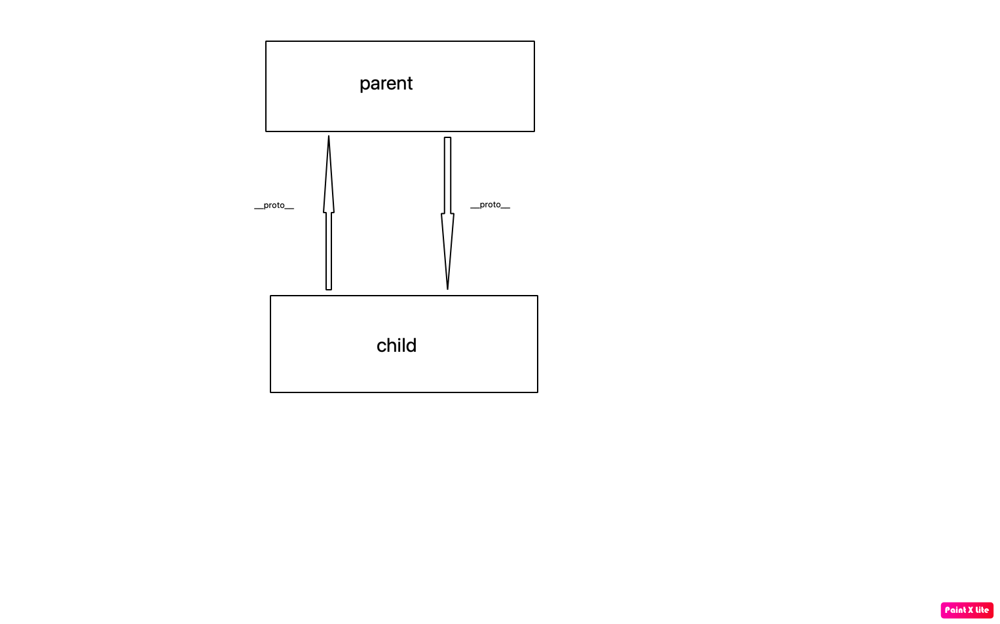
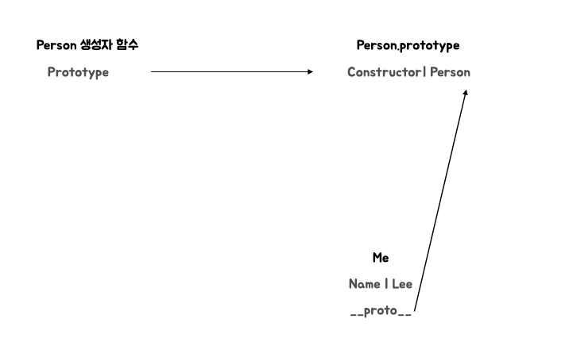

# 프로토타입

자바스크립트는 클래스기반 객체지향 프로그래밍언어보다 더 강력한 객체 지향 프로그래밍능력을 가지고 있는 프로토타입 기반의 객체지향 프로그래밍언어이다.

자바스크립트는 객체 기반의 프로그래밍언어이며 **자바스크립트를 이루고 있는 거의 모든것이 객체**이다.

## 객체 지향 프로그래밍

객체 지향 프로그래밍은 프로그램을 명령어 또는 함수의 목록으로 보는 전통적인 명령형 프로그래밍의 절차지향적 관점에서 벗어나 여러개의 독립적 단위, 즉 **객체**의 집합으로 프로그램을 표현하려는 프로그래밍 패러다임을 말한다.

사람에게는 다양한 속성이 있지만 우리의 프로그램에서는 `이름`, `주소`라는 속성에만 관심이 있다고 가정하면 이러한 필요한 속성한 간추려 표현하는것을 `추상화`라고 한다.

**속성을 통하여 여러개의 값을 하나의 단위로 구성한 복합적인 자료구조를 객체**라고 하며 이러한 독립적인 객체의 집합으로 프로그램을 표현하려는 프로그래밍 패러다임이다.

객체지향 프로그래밍은 객체의 **상태**를 나타내는 데이터와 상태 데이터를 조작할수 있는 **동작**을 하나의 논리적인 단위로 묶어 생각한다.

## 상속과 프로토타입

상속은 객체지향 프로그래밍의 핵심 개념으로, 어떤 객체의 프로퍼티또는 메서드를 다른 객체가 상속받아 그대로 사용할수 있는것을 말한다.

자바스크립트는 프로토타입을 기반으로 상속을 구현하여 불필요한 중복을 제거한다.

```jsx
// 생성자 함수
function Circle(radius) {
  this.radius = radius;
  this.getArea = function () {
    // Math.PI는 원주율을 나타내는 상수다.
    return Math.PI * this.radius ** 2;
  };
}

// 반지름이 1인 인스턴스 생성
const circle1 = new Circle(1);
// 반지름이 2인 인스턴스 생성
const circle2 = new Circle(2);

// Circle 생성자 함수는 인스턴스를 생성할 때마다 동일한 동작을 하는
// getArea 메서드를 중복 생성하고 모든 인스턴스가 중복 소유한다.
// getArea 메서드는 하나만 생성하여 모든 인스턴스가 공유해서 사용하는 것이 바람직하다.
console.log(circle1.getArea === circle2.getArea); // false

console.log(circle1.getArea()); // 3.141592653589793
console.log(circle2.getArea()); // 12.566370614359172
```

여기서 `radius`값은 인스턴스마다 달라야 하지만 `getArea()` 함수는 동일한 내용의 메서드를 사용하는것은 모든 인스턴스가 공유해서 사용하는것이 바람직하다.

그런데 Circle생성자 함수는 인스턴스를 생성할때마다 `getArea`메서드를 중복 생성하고 모든 인스턴스가 중복 소유한다.

이제 상속을 통해 중복을 제거해보자. **자바스크립트는 프로토타입을 기반으로 상속을 구현한다.**

```jsx
// 생성자 함수
function Circle(radius) {
  this.radius = radius;
}

// Circle 생성자 함수가 생성한 모든 인스턴스가 getArea 메서드를
// 공유해서 사용할 수 있도록 프로토타입에 추가한다.
// 프로토타입은 Circle 생성자 함수의 prototype 프로퍼티에 바인딩되어 있다.
Circle.prototype.getArea = function () {
  return Math.PI * this.radius ** 2;
};

// 인스턴스 생성
const circle1 = new Circle(1);
const circle2 = new Circle(2);

// Circle 생성자 함수가 생성한 모든 인스턴스는 부모 객체의 역할을 하는
// 프로토타입 Circle.prototype으로부터 getArea 메서드를 상속받는다.
// 즉, Circle 생성자 함수가 생성하는 모든 인스턴스는 하나의 getArea 메서드를 공유한다.
console.log(circle1.getArea === circle2.getArea); // true

console.log(circle1.getArea()); // 3.141592653589793
console.log(circle2.getArea()); // 12.566370614359172
```

상속은 이렇게 재사용이란 관점에서 매우 유용하다.

생성자 함수가 생성할 모든 인스턴스가 공통적으로 사용할 프로퍼티나 메서드를 프로토타입에 미리 구현해두면 생성자 함수가 생성할 모든 인스턴스는 별도의 구현없이 상위 객체인 프로토타입의 자산을 공유하여 사용할수 있다.

## 프로토타입 객체

프로토타입 객체란 객체지향 프로그래밍의 근간을 이루는 객체간 상속을 구현하기 위해 사용된다.

프로토타입은 어떤 객체의 상위객체의 역할을 하는 객체로서 다른 객체에 공유 프로퍼티를 제공한다.

프로토타입을 상속받은 하위객체는 상위 객체의 프로퍼티를 자신의 프로퍼티처럼 자유롭게 사용가능하다.

모든객체는 `[[Prototype]]`이라는 내부 슬롯을 가지며, 이 내부슬롯의 값은 프로토타입의 참조다.

`[[Prototype]]`에 저장되는 프로토타입은 객체 생성 방식에 의해 결정된다. 객체가 생성될때 `생성방식`에 따라 프로토타입이 결정되고 `[[Prototype]]`에 저장된다.

예를들어, **객체 리터럴에 의해 생성된 객체의 프로토타입**은 Object.prototype이고 **생성자 함수에 의해 생성된 프로토타입**은 생성자함수의 prototype 프로퍼티에 바인딩 되어있는 객체다.
(이에대해서는 19.6에서 알아보자!)

모든 객체는 하나의 프로토타입을 갖는다. 그리고 모든 프로토타입은 생성자 함수와 연결되어있다.

`[[Prototype]]` 내부슬롯에는 직접 접근할수는 없지만 **proto**를 이용하여 자신의 프로토타입에 간접적으로 접근이 가능하다.

## `__proto__` 접근자 프로퍼티

모든객체는 **proto**접근자 프로퍼티를 통해 자신의 프로토타입, 즉 [[prototype]] 내부 슬롯에 간접적으로 접근 가능하다.

## `__proto__`는 접근자 프로퍼티이다!

자바스크립트는 내부슬롯과 내부 메서드에 직접적으로 접근하거나 호출할수 있는 방법을 제공하지 않는다.

하지만 일부내부슬롯과 내부 메서드에 한하여 간접적으로 접근할수 있는 수단을 제공하기는 한다.

`[[Prototype]]` 내부슬롯에는 직접 접근할수는 없지만 **proto**를 이용하여 자신의 프로토타입에 간접적으로 접근이 가능하다.

`__proto__` 는 getter이자 setter로 활용이 되어 부르거나 설정할수가 있다.

## `__proto__`는 상속을 통해 결정된다.

`__proto__` 접근자 프로퍼티는 객체가 직접 소유하는 프로퍼티가 아니라 `Object.prototype`의 프로퍼티이다.

모든 객체는 상속을 통하여 `Object.prototype.__proto__` 접근자 프로퍼티를 사용할수있다.

## 왜 `__proto__`를 이용하여 프로토타입에 접근을 할까?

`[[Prototype]]` 내부슬롯의 값, 즉 프로토타입에 접근하기 위해 접근자 프로퍼티를 사용하는 이유는 **상호참조**에 의해 프로토타입 체인이 생성되는것을 방지하기 위해서다.

```jsx
const parent = {};
const child = {};

// child의 프로토타입을 parent로 설정
child.__proto__ = parent;
// parent의 프로토타입을 child로 설정
parent.__proto__ = child; // TypeError: Cyclic __proto__ value
```

이렇게 서로를 참조하는코드가 정상적으로 처리되면 서로가 자신의 프로토타입이 되는 비정상적인 프로토타입 체인이 만들어지기에 에러를 발생시킨다.



프로토타입 체인은 단방향 연결리스트로 구현되어야한다. 즉, 프로퍼티 검색 방향이 한쪽 방향으로만 흘러가야 한다.

그림과 같은 서로가 자신의 프로토타입을 할 경우 프로토타입 체인 종점이 존재하지않기 때문에 프로토타입 체인에서 프로퍼티를 검색할시 무한루프에 빠진다.

그래서 아무런 체크없이 프로토타입을 교체할수 없도록 `__proto__` 접근자 프로퍼티를 통해 프로토타입에 접근하고 교체하도록 구현되어있다!

## `__proto__` 접근자 프로퍼티를 코드내에서 직접 사용하는것은 권장되지 않는다.

모든객체가 `__proto__` 프로퍼티를 사용할수 있는것이 아니다.

직접 상속을 통해 다음과 같이 `Object.prototype`을 상속받지 않는 객체를 생성할수도 있기 때문이다.

```jsx
// obj는 프로토타입 체인의 종점이다. 따라서 Object.__proto__를 상속받을 수 없다.
const obj = Object.create(null);

// obj는 Object.__proto__를 상속받을 수 없다.
console.log(obj.__proto__); // undefined

// 따라서 Object.getPrototypeOf 메서드를 사용하는 편이 좋다.
console.log(Object.getPrototypeOf(obj)); // null
```

그래서 `__proto__` 대신에 `Object.getPrototypeOf`로 접근을 하고 교체가 필요한경우 `Object.setPrototypeOf`를 이용할것을 권장한다.

```jsx
const obj = {};
const parent = { x: 1 };

// obj 객체의 프로토타입을 취득
Object.getPrototypeOf(obj); // obj.__proto__;
// obj 객체의 프로토타입을 교체
Object.setPrototypeOf(obj, parent); // obj.__proto__ = parent;

console.log(obj.x); // 1
```

## 함수 객체의 prototype 프로퍼티

**함수 객체만이 소유하는 prototype프로퍼티는 생성자 함수가 생성할 인스턴스의 프로토타입을 가리킨다.**

```jsx
// 함수 객체는 prototype 프로퍼티를 소유한다.
(function () {}.hasOwnProperty("prototype")); // -> true

// 일반 객체는 prototype 프로퍼티를 소유하지 않는다.
({}.hasOwnProperty("prototype")); // -> false
```

prototype 프로퍼티는 생성자 함수가 생성할 객체(인스턴스)의 프로토타입을 가르킨다!

따라서 생성자함수를 생성할수없는 non-constructor인 `화살표함수`와 es6 `메서드 축약표현으로 정의한 메서드`는 prototype프로퍼티를 소유하지도 생성하지도 않는다.

모든 객체가 가지고있는 `__proto__`접근자 프로퍼티와 함수 객체만이 가지고 있는 prototype 프로퍼티는 결국 동일한 프로토타입을 가르킨다.

| 구분                        | 소유        | 값                | 사용주체    | 사용 목적                                                                    |
| --------------------------- | ----------- | ----------------- | ----------- | ---------------------------------------------------------------------------- |
| `__proto__` 접근자 프로퍼티 | 모든 객체   | 프로토타입의 참조 | 모든객체    | 객체가 자신의 프로토타입에 접근 혹은 교체하기위해 사용                       |
| prototype 프로퍼티          | constructor | 프로토타입의 참조 | 생성자 함수 | 생성자 함수가 자신이 생성할 객체(인스턴스)의 프로토타입을 할당하기 위해 사용 |

```jsx
// 생성자 함수
function Person(name) {
  this.name = name;
}

const me = new Person("Lee");

// 결국 Person.prototype과 me.__proto__는 결국 동일한 프로토타입을 가리킨다.
console.log(Person.prototype === me.__proto__); // true
```



## 프로토타입의 constructor 프로퍼티와 생성자 함수

모든 프로토타입은 constructor 프로퍼티를 가진다. 이 constructor 프로퍼티는 prototype 프로퍼티로 자신을 참조하고 있는 생성자 함수를 가리킨다.

이 연결은 생성자 함수가 생성시, 즉 함수 객체 생성시에 이뤄진다.

```jsx
// 생성자 함수
function Person(name) {
  this.name = name;
}

const me = new Person("Lee");

// me 객체의 생성자 함수는 Person이다.
console.log(me.constructor === Person); // true
```

위의 예제에서 Person 생성자 함수는 me객체를 생성하였다. 이때 me 객체는 프로토타입의 constructor 프로퍼티를 통해 생성자 함수와 연결된다.

me객체에는 constructor 프로퍼티가 없지만 me 객체의 프로토타입인 Person.prototype에는 constructor 프로퍼티가 있다.

따라서 me 객체는 프로토타입인 Person.prototype의 constructor프로퍼티를 상속받아 사용가능하다!


## 리터럴 표기법에 의해 생성된 객체의 생성자 함수와 프로토타입

앞에서 살펴본 바와 같이 생성자 함수에 의해 생성된 인스턴스는 프로토타입의 constructor 프로퍼티에 의해 생성자 함수와 연결된다.

이때 constructor 프로퍼티가 가르키는 생성자 함수는 인스턴스를 생성한 생성자 함수이다.

```jsx
// obj 객체를 생성한 생성자 함수는 Object다.
const obj = new Object();
console.log(obj.constructor === Object); // true

// add 함수 객체를 생성한 생성자 함수는 Function이다.
const add = new Function("a", "b", "return a + b");
console.log(add.constructor === Function); // true

// 생성자 함수
function Person(name) {
  this.name = name;
}

// me 객체를 생성한 생성자 함수는 Person이다.
const me = new Person("Lee");
console.log(me.constructor === Person); // true
```

하지만 new 를 이용하지 않고 하는 방법도 존재한다. 이때는 어떻게 동작을 할까?

```jsx
// obj 객체는 Object 생성자 함수로 생성한 객체가 아니라 객체 리터럴로 생성했다.
const obj = {};

// 하지만 obj 객체의 생성자 함수는 Object 생성자 함수다.
console.log(obj.constructor === Object); // true
```

위 예제의 obj 객체는 Object 생성자 함수로 생성한 객체가 아니라 객체 리터럴에 의해 생성된 객체이다.

하지만 obj객체는 Object 생성자 함수와 constructor 프로퍼티로 연결되어있다. 그렇다면 객체 리터럴에 의해 생성된 객체는
사실 Object 생성자 함수로 생성되는거 아닐까??

다음은 Object 생성자 함수의 동장 방식이다.

```jsx
// 1. new.target이 undefined나 Object가 아닌 경우
// 인스턴스 -> Foo.prototype -> Object.prototype 순으로 프로토타입 체인이 생성된다.
class Foo extends Object {}
new Foo(); // Foo {}

// 2. Object 생성자 함수에 의한 객체 생성
// Object 생성자 함수는 new 연산자와 함께 호출하지 않아도 new 연산자와 함께 호출한 것과 동일하게 동작한다.
// 인수가 전달되지 않았을 때 추상 연산 OrdinaryObjectCreate를 호출하여 빈 객체를 생성한다.
let obj = new Object();
console.log(obj); // {}

// 3. 인수가 전달된 경우에는 인수를 객체로 변환한다.
// Number 객체 생성
obj = new Object(123);
console.log(obj); // Number {123}

// String  객체 생성
obj = new Object("123");
console.log(obj); // String {"123"}
```

객체 리터럴이 평가될때는 다음과 같이 추상연산 `OrdinaryObjectCreate`를 호출하여 빈 객체를 생성하고 프로퍼티를 추가하도록 정의되어 있다.

이처럼 `Object` 생성자 함수 호출과 `객체 리터럴` 평가는 추상연산 `OrdinaryObjectCreate`를 호출하여 빈 객체를 생성하는 점에서 동일하나 **new.target의 확인이나 프로퍼티를 추가하는 처리등 세부내용은 다르다**

따라서 객체리터럴로 생성된 객체는 `Object` 생성자 함수가 생성한 객체가 아니다.

---

함수 객체의 경우 그 차이가 좀더 명확하다.

`Function` 생성자 함수는 렉시컬 스코프를 만들지 않고 전역 함수인것처럼 스코프를 생성하며 클로저도 만들지 않는다.

따라서 함수 선언문과 함수 표현식을 이용해 만든 함수 객체는 `Function` 생성자 함수가 아니다.

하지만 constructor 프로퍼티를 통해 확인하면 foo의 생성자 함수는 `Function`이다.

```jsx
// foo 함수는 Function 생성자 함수로 생성한 함수 객체가 아니라 함수 선언문으로 생성했다.
function foo() {}

// 하지만 constructor 프로퍼티를 통해 확인해보면 함수 foo의 생성자 함수는 Function 생성자 함수다.
console.log(foo.constructor === Function); // true
```

리터럴 표기법에 의해 생성된 객체도 상속을 위해 프로토타입이 필요하다!

따라서 리터럴 표기법에 의해 생성된객체도 가상적인 생성자 함수를 가진다. 프로토타입은 생성자 함수와 더불어 생성되며 prototype, constructor 프로퍼티에 의해 연결되어 있기 때문이다.

**즉, 프로토타입과 생성자함수는 단독으로 존재할수 없고 항상 쌍으로 존재한다.**

리터럴 표기법에 의해 생성된 객체는 생성자 함수에 의해 생성된 객체가 아니다. 하지만 큰틀에서 생각해보면 리털러 표기법으로 생성한 객체도 생성자 함수로 생성한 객체와 본질적인 면에서 큰 차이가 없다.

예를들어, 객체리터럴에 의해 생성한 객쳉좌 Object 생성자 함수에 의해 생성한 객체는 생성 과정에 미묘한 차이가 있지만 결국 객체로서 동일한 특성을 가진다.

함수리터럴에 의해 생성한 함수와 Function 생성자 함수에 의해 생성한 함수도 클로저, 스코프에 차이는 있지만 함수라는 동일한 특성을 가진다.

## 프로토 타입의 생성 시점

**프로토타입은 생성자 함수가 생성되는 시점에 더불어 생성된다**

아까 설명했듯이 프로토타입과 생성자 함수는 단독으로 존재할수 없고 언제나 쌍으로 존재하기때문이다.

생성자 함수는 사용자가 생성한 사용자 정의 생성자 함수 그리고 기본으로 존재하는 빌트인 생성자 함수를 구분하여 프로토타입 생성시점에 살펴보자

### 사용자 정의 생성자 함수와 프로토타입 생성시점

생성자 함수로서 호출할수 있는 함수, 즉 constructor는 함수 정의가 평가되어 함수 객체를 생성하는 시점에 프로토타입도 더불어 생성된다.

```jsx
// 함수 정의(constructor)가 평가되어 함수 객체를 생성하는 시점에 프로토타입도 더불어 생성된다.
console.log(Person.prototype); // {constructor: ƒ}

// 생성자 함수
function Person(name) {
  this.name = name;
}
```

생성자 함수로서 호출할수 없는 함수, 즉 non-constructor는 프로토타입이 생성되지않는다.

```jsx
// 화살표 함수는 non-constructor다.
const Person = (name) => {
  this.name = name;
};

// non-constructor는 프로토타입이 생성되지 않는다.
console.log(Person.prototype); // undefined
```

함수 선언문은 런타임 이전에 자바스크립트 엔진에 의해 먼저 실행된다.

따라서 함수 선언문으로 정의된 Person 생성자 함수는 어떤 코드보다 먼저 평가 되어 함수객체가 된다.
**이때 더불어 프로토타입도 생성된다.**

이처럼 빌트인 생성자 함수가 아닌 사용자 정의 생성자 함수는 자신이 평가되어 함수 객체로 생성되는 시점에 프로토타입도 더불어 생성된다.

### 빌트인 생성자 함수와 프로토타입 생성 시점

모든 빌트인 생성자 함수는 전역객체가 생성되는 시점에 생성된다. 생성된 프로토타입은 빌트인 생성자 함수의 prototype 프로퍼티에 바인딩 된다.

이처럼 객체가 생성되기 이전에 생성자 함수와 프로토타입은 이미 객체화되어 존재한다.

**이후 생성자 함수또는 리터럴 표기법으로 객체를 생성하면 프로토타입은 생성된 객체의 `[[Prototype]]` 내부 슬롯에 할당된다.**
이로써 생성된 객체는 프로토타입을 상속받는다.

## 객체 생성 방식과 프로토타입의 결정

객체는 다음과 같이 다양한 생성 방법이 있다.

- 객체 리터럴
- Object 생성자 함수
- 생성자 함수
- Object.create 메서드
- 클래스(es6)

이처럼 다양한 방식으로 생성된 모든 객체는 각 방식마다 세부적인 생성 방식의 차이는 있으나 추상 연산 `OrdinaryObjectCreate`에 의해 생성된다는 공통점이 있다.

추상연산 `OrdinaryObjectCreate`는 필수적으로 자신이 생성할객체의 프로토타입을 인수로 받는다.

그리고 자신이 생성할 객체에 추가할 프로퍼티 목록을 옵션으로 전달할수 있다. 추상연산 `OrdinaryObjectCreate`는 빈 객체를 생성한후, 객체에 추가할 프로퍼티 목록이 인수로 전달된 경우 프로퍼티를 객체에 추가한다.

그리고 인수로 전달받은 자신이 생성한 객체의 `[[Prototype]]` 내부 슬롯에 할당한 다음, 생성한 객체를 반환한다.

즉, 프로토타입은 추상 연산 `OrdinaryObjectCreate`에 전달되는 **인수에 의해 결정된다.**이 인수는 객체가 생성되는 시점에 객체 생성 방식에 의해 결정된다.

### 객체 리터럴에 의해 생성된 객체의 프로토타입

자바스크립트는 객체 리터럴을 평가하여 객체를 생성할때 추상연산 `OrdinaryObjectCreate`를 호출한다.

이때 추상연산 `OrdinaryObjectCreate`에 전달되는 프로토타입은 Object.prototype이다.

```jsx
const obj = { x: 1 };
```

위 객체 리터럴이 평가되면 추상 연산 `OrdinaryObjectCreate`에 의해 Object 생성자함수와 Object.prototype과 생성된 객체 사이에 연결이 만들어진다.

이처럼 obj객체는 Object.prototype을 프로토타입으로 가지게 되며, Objecct.prototype을 상속받는다.

obj객체가 constructor랑 hasOwnProperty등등을 가지고 있는것 같지만 자신의 프로토타입인 Object.prototype을 자유롭게 사용할수 있는것이다.

## Object 생성자 함수에 의해 생성된 객체의 프로토 타입

Object 생성자함수를 인수없이 호출하면 빈객체가 생성된다.

Object생성자 함수를 호출할시에 객체리터럴과 마찬가지로 추상연산 `OrdinaryObject` 가 호출된다. 이때 추상연산 `OrdinaryObject`에 전달되는 프로토타입은 Object.prototype이다.

이처럼 객체리터럴과 생성자 함수 방식은 객체생성방식에 차이만 있고 동일하다. 객체리터럴 내부에 프로퍼티를 추가하지만 Object 생성자 함수 방식은 일단 빈객체를 생성한 이후 프로퍼티를 추가해야한다.

## 생성자 함수에 의해 생성된 객체의 프로토타입

new 연산자와 함께 생성자함수를 호출하여 인스턴스를 생성하면 다른 객체 생성 방식과 마찬가지로 추상연산 `OrdinaryObject`가 호츨된다. 이때 `OrdinaryObject`에 전달되는 프로토타입은 생성자함수의 prototype 프로퍼티에 바인딩 되어있는 객체다.

```jsx
function Person(name) {
  this.name = name;
}

const me = new Person("me");
```

위 코드가 실행되면 추상연산 `OrdinaryObjectCreate` 에 의해 **생성자 함수와 생성자 함수의 prototype 프로퍼티에 바인딩 되어있는 객체와 생성된객체 사이**에 연결이 만들어진다.

프로토타입 Person.prototype에 프로퍼티를 추가하여 하위 객체가 상속받을수 있도록 구현해보자.

프로토타입도 객체이기에 프로퍼티를 추가/삭제 할수있다. 그리고 이렇게 추가/삭제한것은 바로 프로토체인에 즉각 반응한다.

```jsx
function Person(name) {
  this.name = name;
}

// 프로토타입 메서드
Person.prototype.sayHello = function () {
  console.log(`Hi! My name is ${this.name}`);
};

const me = new Person("Lee");
const you = new Person("Kim");

me.sayHello(); // Hi! My name is Lee
you.sayHello(); // Hi! My name is Kim
```

Person생성자 함수를 통해 생성된 모든 객체는 프로토타입에 추가된 sayHello메서드를 상속받아 자신의 메서드로 사용할수 있다.

## 프로토타입 체인

다음 예제를 살펴보자

```jsx
function Person(name) {
  this.name = name;
}

Person.prototype.sayHello = function () {
  console.log(`Hi, my name is ${this.name}`);
};

const me = new Person("Lee");

console.log(me.hasOwnProperty("name"));
```

Person 생성자 함수에 의해 생성된 me 객체는 Object.prototype의 메서드인 hasOwnProperty를 호출할수 있다.

이는 me객체가 Person.prototype 뿐만 아니라 Object.prototype도 상속받았다는것을 의미한다.
**me 객체의 프로토타입은 Person.prototype이다.**

```jsx
Object.getPrototypeOf(me) === Person.prototype; // -> true

Object.getPrototypeOf(Person.prototype) === Object.prototype; // -> true
```


자바스크립트는 객체의 프로퍼티에 접근하려고 할떄 해당 객체에 접근하려는 프로퍼티가 없을시 `[[Prototype]]` 내부 슬롯의 참조를 따라 자신의 부모 역할을 하는 프로토타입의 프로퍼티를 순차적으로 검색한다.

이를 **프로토타입 체인** 이라고 한다. **프로토타입 체인은 자바스크립트가 객체지향 프로그래밍의 상속을 구현하는 메커니즘이다.**

```jsx
// hasOwnProperty는 Object.prototype의 메서드다.
// me 객체는 프로토타입 체인을 따라 hasOwnProperty 메서드를 검색하여 사용한다.
me.hasOwnProperty("name"); // -> true
```

1. 먼저 hasOwnProperty를 호출한 me객체에서 hasOwnProperty를 검색한다. 하지만 me객체에는 존재하지 않으므로 프로토타입 체인을 따라 Person.prototype을 검색한다.

2. Person.prototype에도 hasOwnProperty가 존재하지 않기때문에 프로토타입 체인을 따라 Object.prototype을 검색한다.

3. Object.prototype에는 hasOwnProperty가 존재한다. 자바스크립트 엔진은 Object.prototype.hasOwnProperty 메서드를 호출하고 여기에서의 this는 me 객체가 바인딩 된다.

```jsx
Object.prototype.hasOwnProperty.call(me, "name");
```

프로토타입 최상위에 위치하는 객체는 항상 Object.prototype 이다. 따라서 모든객체는 Object.prototype을 상속받는다.

Object.prototype을 프로토타입 체인의 종점이라 한다. 그래서 Object.prototype의 `[[Prototype]]` 은 항상 null이다.

프로토타입 체인의 종점인 Object.prototype에서도 프로퍼티를 검색할수 없는 경우 에러가 아닌 **undefined**를 반환한다.

---

이처럼 자바스크립트 엔진은 프로토타입 체인을 따라 프로퍼티/메서드를 검색한다.

따라서 **프로토타입 체인은 상속과 프로퍼티 검색을 위한 메커니즘**이다.

이에 비해 프로퍼티가 아닌 식별자는 **스코프 체인**에서 검색한다. 따라서 **스코프 체인은 식별자 검색을 위한 메커니즘이다.**

```jsx
me.hasOwnProperty("name");
```

위 예제의 경우, 먼저 스코프체인에서 me를 검색한다. me객체는 전역에서 선언됬으므로 전역 스코프에서 검색된다. 그 다음 hasOwnProperty를 프로토타입 체인에서 검색을 한다.

**이처럼 스코프 체인과 프로토타입 체인은 서로 연관없이 별도로 동작하는것이 아니라 서로 협력하여 식별자와 프로퍼티를 검색하는데 사용된다**

## 오버라이딩과 프로퍼티 섀도잉

```jsx
const Person = (function () {
  // 생성자 함수
  function Person(name) {
    this.name = name;
  }

  // 프로토타입 메서드
  Person.prototype.sayHello = function () {
    console.log(`Hi! My name is ${this.name}`);
  };

  // 생성자 함수를 반환
  return Person;
})();

const me = new Person("Lee");

// 인스턴스 메서드
me.sayHello = function () {
  console.log(`Hey! My name is ${this.name}`);
};

// 인스턴스 메서드가 호출된다. 프로토타입 메서드는 인스턴스 메서드에 의해 가려진다.
me.sayHello(); // Hey! My name is Lee
```


프로토타입이 소유한 프로퍼티를 프로토타입 프로퍼티, 인스턴스가 소유한 프로퍼티를 인스턴스 프로퍼티라고 한다.

프로토타입 프로퍼티와 같은 이름의 프로퍼티를 인스턴스에 추가하면 프로토타입 체인을 따라 프로토타입 프로퍼티를 검색하여 프로토타입 프로퍼티를 덮어쓰는것이 아니라 인스턴스 프로퍼티로 추가한다.

이때 인스턴스 메서드 sayHello 는 프로토타입 메서드 sayHello를 **오버라이딩** 했고 프로토타입 메서드 sayHello는 가려진다. 이렇게 가려지는 현상을 **프로퍼티 섀도잉**이라고 한다.

## 프로퍼티의 삭제

```jsx
// 인스턴스 메서드를 삭제한다.
delete me.sayHello;
// 인스턴스에는 sayHello 메서드가 없으므로 프로토타입 메서드가 호출된다.
me.sayHello(); // Hi! My name is Lee
```

당연히 프로토타입의 메서드가 아닌 인스턴스 메서드 sayHello가 삭제된다.

```jsx
// 프로토타입 체인을 통해 프로토타입 메서드가 삭제되지 않는다.
delete me.sayHello;
// 프로토타입 메서드가 호출된다.
me.sayHello(); // Hi! My name is Lee
```

한번더 sayHello를 삭제해서 프로토타입 프로퍼티의 삭제를 시도해보자. 하지만 아무런 변화가 일어나지 않는다.

이와 같이 하위객체를 통해 프로토타입의 변경또는 삭제는 불가능하다. `get액세스는 허용하지만 set은 허용하지 않는것이다.`

그래서 프로토타입 프로퍼티를 변경 또는 삭제하려면 프로토타입 체인으로 접근하는것이 아니라 직접 접근을 해야한다.

```jsx
// 프로토타입 메서드 변경
Person.prototype.sayHello = function () {
  console.log(`Hey! My name is ${this.name}`);
};
me.sayHello(); // Hey! My name is Lee

// 프로토타입 메서드 삭제
delete Person.prototype.sayHello;
me.sayHello(); // TypeError: me.sayHello is not a function
```

## 프로토타입의 교체

프로토타입은 임의의 다른 객체로 변경가능하다. 이것은 부모객체인 프로토타입을 동적으로 변경할수있다는것을 의미한디.
프로토타입은 **생성자 함수** 또는 **인스턴스**에 의해 교체할수 있다.

### 생성자 함수에 의한 프로토타입의 교체

```jsx
const Person = (function () {
  function Person(name) {
    this.name = name;
  }

  // ① 생성자 함수의 prototype 프로퍼티를 통해 프로토타입을 교체
  Person.prototype = {
    sayHello() {
      console.log(`Hi! My name is ${this.name}`);
    },
  };

  return Person;
})();

const me = new Person("Lee");
```

프로토타입으로 교체한 객체리터럴에는 constructor 프로퍼티가 없다. **constructor 프로퍼티는 자바스크립트 엔진이 프로토타입을 생성할때 암묵적으로 추가되는 프로퍼티이다.**
따라서 me객체의 생성자 함수를 검색하면 Person이 아닌 Object가 나온다.

```jsx
console.log(me.constructor === Person); // false
console.log(me.constructor === Object); // true
```

이처럼 프로토타입을 교체하면 constructor 프로퍼티와 생성자 함수 간의 연결이 파괴된다. 파괴된 constructor 프로퍼티와 생성자 함수 간의 연결을 되살려보자!

```jsx
const Person = (function () {
  function Person(name) {
    this.name = name;
  }

  // 생성자 함수의 prototype 프로퍼티를 통해 프로토타입을 교체
  Person.prototype = {
    // constructor 프로퍼티와 생성자 함수 간의 연결을 설정
    constructor: Person,
    sayHello() {
      console.log(`Hi! My name is ${this.name}`);
    },
  };

  return Person;
})();

const me = new Person("Lee");

// constructor 프로퍼티가 생성자 함수를 가리킨다.
console.log(me.constructor === Person); // true
console.log(me.constructor === Object); // false
```

### 인스턴스에 의한 프로토타입의 교체

프로토타입은 생성자함수의 prototype 프로퍼티 뿐만 아니라 인스턴스의 `__proto__` 접근자 프로퍼티를 통해 접근할수 있다.

따라서 `__proto__` 접근자 프로퍼티를 통해 프로토타입을 변경할수도 있다.

그러면 생성자 함수에 의한 프로토타입 교체랑 무엇이 다른걸까?

- 생성자 함수의 prototype 프로퍼티에 다른 임의의 객체를 바인딩하는 것은 미래에 생성할 인스턴스의 프로토타입을 교체하는 것이다.
- `__proto__` 접근자 프로퍼티를 통해 프로토타입을 교체하는것은 이미 생성된 객체의 프로토타입을 교체하는 것이다.

```jsx
function Person(name) {
  this.name = name;
}

const me = new Person("Lee");

// 프로토타입으로 교체할 객체
const parent = {
  sayHello() {
    console.log(`Hi! My name is ${this.name}`);
  },
};

// ① me 객체의 프로토타입을 parent 객체로 교체한다.
Object.setPrototypeOf(me, parent);
// 위 코드는 아래의 코드와 동일하게 동작한다.
// me.__proto__ = parent;

me.sayHello(); // Hi! My name is Lee
```


- 생성자 함수에 의한 교체


- 인스턴스에 의한 교체

> 프로토타입 교체를 통해 객체간의 상속 관계를 동적으로 변경 하는것은 꽤나 번거롭다. 따라서 프로토타입은 직접 교체하지 않는것이 좋다.

## instanceof 연산자

instanceof 연산자는 이항 연산자로서 좌변에 **객체를 가리키는 식별자**, 우변에 **생성자 함수**를 가리키는 식별자를 피연산자로 받는다.

```jsx
객체 instanceof 생성자 함수
```

> 우변의 피연산자가 함수가 아닌 경우 TypeError가 발생한다.

우변의 생성자 함수의 prototype에 바인딩된 객체가 좌변의 객체의 프로토타입 체인상에 존재하면 true, 아니면 false로 나온다.

```jsx
// 생성자 함수
function Person(name) {
  this.name = name;
}

const me = new Person("Lee");

// Person.prototype이 me 객체의 프로토타입 체인 상에 존재하므로 true로 평가된다.
console.log(me instanceof Person); // true

// Object.prototype이 me 객체의 프로토타입 체인 상에 존재하므로 true로 평가된다.
console.log(me instanceof Object); // true
```

```jsx
// 생성자 함수
function Person(name) {
  this.name = name;
}

const me = new Person("Lee");

// 프로토타입으로 교체할 객체
const parent = {};

// 프로토타입의 교체
Object.setPrototypeOf(me, parent);

// Person 생성자 함수와 parent 객체는 연결되어 있지 않다.
console.log(Person.prototype === parent); // false
console.log(parent.constructor === Person); // false

// Person.prototype이 me 객체의 프로토타입 체인 상에 존재하지 않기 때문에 false로 평가된다.
console.log(me instanceof Person); // false

// Object.prototype이 me 객체의 프로토타입 체인 상에 존재하므로 true로 평가된다.
console.log(me instanceof Object); // true
```

me 객체는 비록 프로토타입이 교체되어 프로토타입과 생성자 함수 간의 연결이 파괴되었지만 Person 생성자함수에 의해 생성된 인스턴스 임은 틀림없다.

하지만 Person.prototype이 me객체의 프로토타입 체인상에 존재하지 않기에 false로 나온다.

```jsx
// 생성자 함수
function Person(name) {
  this.name = name;
}

const me = new Person("Lee");

// 프로토타입으로 교체할 객체
const parent = {};

// 프로토타입의 교체
Object.setPrototypeOf(me, parent);

// Person 생성자 함수와 parent 객체는 연결되어 있지 않다.
console.log(Person.prototype === parent); // false
console.log(parent.constructor === Person); // false

// parent 객체를 Person 생성자 함수의 prototype 프로퍼티에 바인딩한다.
Person.prototype = parent;

// Person.prototype이 me 객체의 프로토타입 체인 상에 존재하므로 true로 평가된다.
console.log(me instanceof Person); // true

// Object.prototype이 me 객체의 프로토타입 체인 상에 존재하므로 true로 평가된다.
console.log(me instanceof Object); // true
```

이처럼 instanceof 연산자는 프로토타입의 constructor 프로퍼티가 가리키는 생성자 함수를 찾는 것이 아니라 **생성자 함수의 prototype에 바인딩된 객체가 프로토타입 체인상에 존재하는지 확인한다.**

그래서 constructor가 파괴되어도 프로토타입체인으로 상위 프로토타입을 찾을수 있다!

# 직접 상속

## Object.create에 의한 직접 상속

Object.create 메서드는 명시적으로 프로토타입을 지정하여 새로운 객체를 생성한다. Object.create도 다른 객체생성방식과 동일하게 OrdinaryObjectCreate를 호출한다.

Object.create메서드의 첫번째 매개변수에는 **생성할 객체의 프로토타입으로 지정할 객체**를 전달한다.

두번째 매개변수에는 생성할 객체의 프로퍼티 키와 프로퍼티 디스크립터 객체로 이뤄진 객체를 전달한다.(생략 가능하다)

```jsx
// 프로토타입이 null인 객체를 생성한다. 생성된 객체는 프로토타입 체인의 종점에 위치한다.
// obj → null
let obj = Object.create(null);
console.log(Object.getPrototypeOf(obj) === null); // true
// Object.prototype을 상속받지 못한다.
console.log(obj.toString()); // TypeError: obj.toString is not a function

// obj → Object.prototype → null
// obj = {};와 동일하다.
obj = Object.create(Object.prototype);
console.log(Object.getPrototypeOf(obj) === Object.prototype); // true

// obj → Object.prototype → null
// obj = { x: 1 };와 동일하다.
obj = Object.create(Object.prototype, {
  x: { value: 1, writable: true, enumerable: true, configurable: true },
});
// 위 코드는 다음과 동일하다.
// obj = Object.create(Object.prototype);
// obj.x = 1;
console.log(obj.x); // 1
console.log(Object.getPrototypeOf(obj) === Object.prototype); // true

const myProto = { x: 10 };
// 임의의 객체를 직접 상속받는다.
// obj → myProto → Object.prototype → null
obj = Object.create(myProto);
console.log(obj.x); // 10
console.log(Object.getPrototypeOf(obj) === myProto); // true

// 생성자 함수
function Person(name) {
  this.name = name;
}

// obj → Person.prototype → Object.prototype → null
// obj = new Person('Lee')와 동일하다.
obj = Object.create(Person.prototype);
obj.name = "Lee";
console.log(obj.name); // Lee
console.log(Object.getPrototypeOf(obj) === Person.prototype); // true
```

즉 이처럼 구현할시 객체를 생성하며 직접적으로 상속을 구현할수가 있다.
이것의 장점은 다음과 같다.

- new 없이도 객체를 생성가능하다
- 프로토타입을 지정하면서 객체를 생성할수 있다
- 객체 리터럴에 의해 생성된 객체도 상속받을수 있다.

**ESLint**에서는 빌트인 메서드(hasOwnProperty등등)을 직접 호출하는것을 권하지 않는다. 그 이유는 Object.create메서드를 이용하여 프로토타입의 종점에 위치하는 객체를 생성할수 있기 때문이다.

```jsx
// 프로토타입이 null인 객체, 즉 프로토타입 체인의 종점에 위치하는 객체를 생성한다.
const obj = Object.create(null);
obj.a = 1;

console.log(Object.getPrototypeOf(obj) === null); // true

// obj는 Object.prototype의 빌트인 메서드를 사용할 수 없다.
console.log(obj.hasOwnProperty("a")); // TypeError: obj.hasOwnProperty is not a function
```

그래서 이러한 빌트인 객체를 사용하고 싶다면 다음과 같이 간접호출하는것을 권장한다.

```jsx
// 프로토타입이 null인 객체를 생성한다.
const obj = Object.create(null);
obj.a = 1;

// console.log(obj.hasOwnProperty('a')); // TypeError: obj.hasOwnProperty is not a function

// Object.prototype의 빌트인 메서드는 객체로 직접 호출하지 않는다.
console.log(Object.prototype.hasOwnProperty.call(obj, "a")); // true
```

## 객체 리터럴 내부에서 `__proto__`에 의한 직접 상속

Object.create 메서드에 의한 직접 상속은 앞에서 다룬것과 같이 여러 장점이 있다. 하지만 두번째 인자로 프로퍼티를 정의하는 법은 번거롭다.

es6에서는 객체 리터럴 내부에서 `__proto__` 접근자 프로퍼티를 사용하여 직접 상속을 구현할수 있다.

```jsx
const myProto = { x: 10 };

// 객체 리터럴에 의해 객체를 생성하면서 프로토타입을 지정하여 직접 상속받을 수 있다.
const obj = {
  y: 20,
  // 객체를 직접 상속받는다.
  // obj → myProto → Object.prototype → null
  __proto__: myProto,
};
/* 위 코드는 아래와 동일하다.
const obj = Object.create(myProto, {
  y: { value: 20, writable: true, enumerable: true, configurable: true }
});
*/

console.log(obj.x, obj.y); // 10 20
console.log(Object.getPrototypeOf(obj) === myProto); // true
```

## 정적 프로퍼티/메서드

정적 프로퍼티/메서드는 생성자 함수로 인스턴스를 생성하지 않아도 참조/호출할수 있는 프로퍼티/메서드를 말한다.

다음 예제를 살펴보자.

```jsx
// 생성자 함수
function Person(name) {
  this.name = name;
}

// 프로토타입 메서드
Person.prototype.sayHello = function () {
  console.log(`Hi! My name is ${this.name}`);
};

// 정적 프로퍼티
Person.staticProp = "static prop";

// 정적 메서드
Person.staticMethod = function () {
  console.log("staticMethod");
};

const me = new Person("Lee");

// 생성자 함수에 추가한 정적 프로퍼티/메서드는 생성자 함수로 참조/호출한다.
Person.staticMethod(); // staticMethod

// 정적 프로퍼티/메서드는 생성자 함수가 생성한 인스턴스로 참조/호출할 수 없다.
// 인스턴스로 참조/호출할 수 있는 프로퍼티/메서드는 프로토타입 체인 상에 존재해야 한다.
me.staticMethod(); // TypeError: me.staticMethod is not a function
```

Person 생성자 함수는 객체이므로 자신의 프로퍼티/메서드를 소유할수있다. Person 생성자 함수 객체가 소유한 프로퍼티/메서드를 정적 프로퍼티/메서드라고 한다.

정적 프로퍼티/메서드는 생성자 함수가 생성한 인스턴스로 참조/호출할수 없다.

생성자 함수가 생성한 인스턴스는 자신의 프로토타입 체인에 소간 객체의 프로퍼티/메서드에 접근할수 있다. 하지만 정적 프로퍼티/메서드는 인스턴스의 프로토타입 체인에 속한 객체의 프로퍼티/메서드가 아니므로 인스턴스로 접근할수 없다.

# 프로퍼티 존재 확인

## in연산자

```jsx
key in object;
```

in 연산자는 객체내에 특정 플퍼티가 존재하는지 여부를 확인한다.

in연산자는 대상 객체의 프로퍼티뿐만 아니라 확인 대상 객체가 상속받은 모든 프로토타입의 프로퍼티를 확인하므로 주의가 필요하다.

```jsx
const person = {
  name: "Lee",
  address: "Seoul",
};

// person 객체에 name 프로퍼티가 존재한다.
console.log("name" in person); // true
// person 객체에 address 프로퍼티가 존재한다.
console.log("address" in person); // true
// person 객체에 age 프로퍼티가 존재하지 않는다.
console.log("age" in person); // false
```

in연산자 대신에 es6에서 도입된 `Reflect.has` 메서드를 이용할수 있다!(동작은 동일하다)

## Object.protoype.hasOwnProperty 메서드

in 연산자와 동일하게 확인할수 있지만 확인 대상 객체에 있는 프로퍼티만 확인한다!

```jsx
console.log(person.hasOwnProperty("name")); // true
console.log(person.hasOwnProperty("age")); // false

console.log(person.hasOwnProperty("toString")); // false
```

# 프로퍼티 열거

## for ... in 문

객체의 모든 프로퍼티를 순회함 열거하려면 for ... in 문을 이용한다.

```jsx
const person = {
  name: "Lee",
  address: "Seoul",
};

// for...in 문의 변수 prop에 person 객체의 프로퍼티 키가 할당된다.
for (const key in person) {
  console.log(key + ": " + person[key]);
}
// name: Lee
// address: Seoul
```

for ... in 문은 in 연산자 처럼 순회 대상 객체의 프로퍼티뿐만 아니라 상속받은 프로토타입의 프로퍼티까지 열거한다.
하지만 위 예제의 경우 `toString`과 같은 Object.prototype의 프로퍼티가 열거되지않는다.

그 이유는 `toString`이 열거할수 없도록 정의되어 있는 프로퍼티이기 때문이다. **다시 말해, Object.prototyype.string 프로퍼티의 프로퍼티 어트리뷰트 `[[Enumerable]]`의 값이 false이기때문이다**

프로퍼티 어트리뷰트 `[[Enumerable]]`은 프로퍼티 열거가능 여부를 나타내며 불리언값을 갖는다.

**즉 for ... in 문은 프로토타입 체인상에 존재하는 모든 프로토타입의 프로토타입의 프로퍼티중에서 프로퍼티 어트리뷰트 `[[Enumerable]]`의 값이 true인 프로퍼티를 순회하며 열거한다.**

> for ... in 문은 키가 심벌인 프로퍼티는 열거하지 않는다.

자신의 프로퍼티만 열거하고 싶다면 hasOwnProperty를 이용하면 된다.

```jsx
const person = {
  name: "Lee",
  address: "Seoul",
  __proto__: { age: 20 },
};

for (const key in person) {
  // 객체 자신의 프로퍼티인지 확인한다.
  if (!person.hasOwnProperty(key)) continue;
  console.log(key + ": " + person[key]);
}
// name: Lee
// address: Seoul
```

## Object.keys/values/entries 메서드

객체 자신의 프로퍼티만 열거하기위해서는 for ... in 문보다는 Object.keys/values/entries 메서드를 사용하는것을 권장한다.

- Object.keys는 열거가능한 프로퍼티의 키를 배열로 반환한다.
- Object.values는 열거가능한 프로퍼티의 값을 배열로 반환한다.
- Object.entries는 열거가능한 프로퍼티의 키와 값의 쌍의 배열을 배열에 담아 반환한다.
