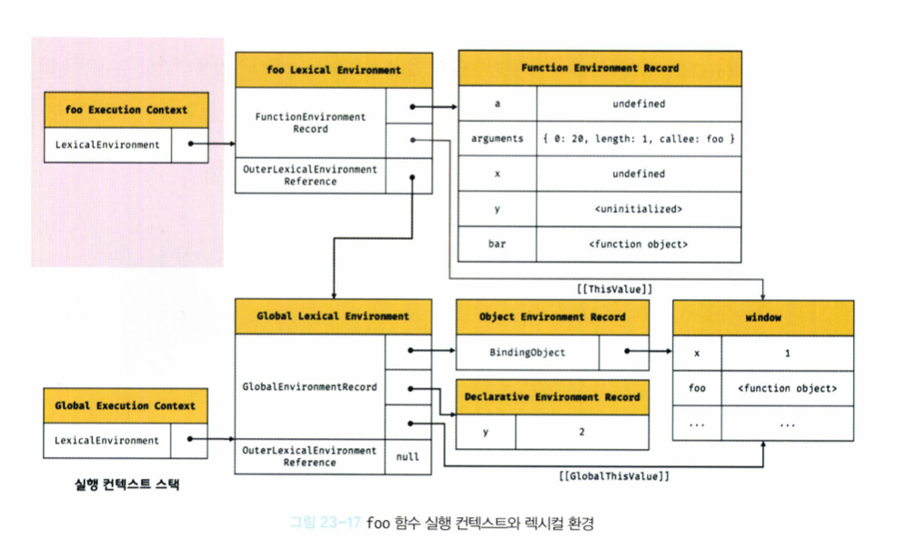

# P359 ~ P 366

## 1. 실행 컨텍스트는 자바스크립트의 동작 원리를 담고 있는 핵심 개념이다

---

실행 컨텍스트의 학습을 통해 아래 내용을 설명할 수 있다면 완벽히 학습한 것!!

- 스코프를 기반으로 식별자와 식별자에 바인딩 된 값을 관리하는 방식
- 호이스팅이 발생하는 이유
- 클로저의 동작 방식
- 태스크 큐와 함께 동작하는 이벤트 핸들러
- 비동기 처리의 동작 방식

들을 알 수 있다.

<br>

## 2. 소스코드는 다음의 타입으로 구분된다.

---

- 전역 코드 : 전역에 존재하는 소스코드. 전역에 정의된 함수나 클래스의 내부 코드는 포함되지 않는다.

- 함수 코드 : 함수 내부에 존재하는 소스코드. 함수 내부에 중첩된 함수, 클래스 등의 내부 코드는 포함되지 않는다.

- eval 코드 : eval 함수에 인수로 전달되어 실행되는 소스코드

- 모듈 코드 : 모듈 내부에 존재하는 소스코드. 모듈 내부의 함수, 클래스 등의 내부 코드는 포함되지 않는다.

이 코드들은 각기 다른 `실행 컨텍스트의 생성, 관리 방법`을 갖는다.

<br>

## 3. 소스코드에 따른 실행 컨텍스트 생성 시기

---

- 전역 코드 : 전역 코드는 최상위 스코프인 전역 스코프를 생성한다. 전역 코드가 `평가`되면, 전역 실행 컨텍스트가 생성된다.

- 함수 코드 : 함수 코드는 지역 스코프를 생성한다. 함수 코드가 `평가`되면, 함수 실행 컨텍스트가 생성된다. **(이 때 생성되는 지역 스코프는 전역 스코프에서 시작하는 스코프 체인의 일원이 된다.)**

- eval 코드 : `strict mode` 에서 자신만의 독자적인 스코프를 생성. eval 코드가 `평가` 되면, eval 실행 컨텍스트가 생성된다.

- 모듈 코드 : 모듈별로 독립적인 모듈 스코프를 생성한다. 모듈 코드가 평가되면 모듈 실행 컨텍스트가 생성된다.

<br>

## 4. 소스코드의 평가는 무엇인가요 ?

---

자바스크립트의 모든 소스코드는 실행에 앞서 평가 과정을 거친다. (코드 실행을 위한 준비 단계) -> `평가`단계와 `실행`단계가 존재하는구나

이 평가 과정에서 다음의 일을 수행합니다.

1. 실행 컨텍스트를 생성

2. 변수 함수 등의 선언문을 먼저 실행하여 생성된 변수, 함수 식별자를 키로 실행 컨텍스트가 관리하는 스코프(렉시컬 환경의 환경 레코드)에 등록

평가 과정이 종료되면, `런타임`이 시작된다. (선언문을 제외한 소스코드가 순차적으로 `실행`된다) -> 런타임에서 참조하는 변수와 함수들은 실행컨텍스트의 스코프에 등록되어 있다.

<br>

## 5. 예시

---

```jsx
var x;

x = 1;
```

1. `평가` 과정에서 `var x;` 가 실행된다. 이 때 생성된 변수 식별자 `x`는 실행 컨텍스트가 관리하는 스코프에 등록되고, `undefined`로 초기화된다.

2. `실행` 과정에서는 `x=1;`만 실행된다. 이 때, 변수에 값을 할당하려면 먼저 `x` 변수의 선언 여부를 따져야한다.

3. 실행 컨텍스트가 관리하는 스코프에 `x` 변수가 등록되어 있는지를 확인한 후, 선언되어 있다면 할 일을 수행한다.

<br>

## 6. 실행 컨텍스트가 해야하는 일

1. 선언에 의해 생성된 모든 식별자를 `스코프를 구분`하여 등록하고, 지속적으로 관리해야한다.

2. 스코프는 중첩 관게에 의해 스코프 체인을 형성해야한다. 즉, 스포크 체인을 통해 상위 스코프로 이동하며 식별자를 검색할 수 있어야한다.

3. 현재 실행 중인 **코드의 실행 순서를 변경**(새로운 함수를 호출하여 생기는 변경)할 수 있어야하며, **다시 되돌아갈 수** 있어야한다. (함수 호출을 했다면, 함수 호출 라인 이 후 라인을 순차 실행해야하므로)

**👏 실행 컨텍스트는 소스코드를 실행하는데 필요한 환경을 제공하고, 코드의 실행 결과를 실제로 관리하는 영역이다. (모든 코드는 실행 컨텍스트를 통해 실행된다.)**

**👏 소스코드를 실행하는데 필요한 환경은 `렉시컬 환경`으로 관리하고, 코드 실행 순서의 관리는 `실행 컨텍스트 스택(이하 콜스택)`으로 관리한다.**

<br>

## 실행 컨텍스트 스택

다음 코드는 전역 코드와 함수 코드로 이루어져있다.

```jsx
const x = 1;

function foo() {
  const y = 2;

  function bar() {
    const z = 3;
    console.log(x + y + z);
  }
  bar();
}
foo(); // 6
```

### 1. 전역 코드의 평가 : 전역 코드를 평가하여 `전역 실행 컨텍스트`를 생성하고 실행 컨텍스트 스택에 푸시한다. (`x`, `foo`가 실행 컨텍스트에 등록)

<br>

### 2. 전역 코드의 실행 : `x`에 값이 할당되고, `foo` 함수가 호출

<br>

### 3. `foo` 함수 코드의 평가 : `foo`가 호출되면, 전역 코드의 실행은 중지되고 자바스크립트 엔진은 `foo` 함수 내부의 코드를 평가하여 `foo 함수 실행 컨텍스트`를 만든다. 이를 실행 컨텍스트 스택에 푸시한다. (`y`와 `bar`가 실행 컨텍스트에 등록)

<br>

### 4. `foo` 함수 코드의 실행 : `y`에 값이 할당되고, `bar`함수가 호출

<br>

### 5. `bar` 함수 코드의 실행 : `bar`가 호출되면, `foo` 코드의 실행은 중지되고 자바스크립트 엔진은 `bar` 함수 내부의 코드를 평가하여 `bar 함수 실행 컨텍스트`를 만든다. 이를 실행 컨텍스트 스택에 푸시한다. (`z`가 실행 컨텍스트에 등록)

<br>

### 6. `bar` 함수 코드의 실행 : `z`에 값이 할당되고, `console.log`함수를 호출, `bar` 함수가 종료된다.

<br>

### 7. `foo` 함수 코드로 복귀 : `bar 함수 실행 컨텍스트`를 실행 컨텍스트 스택에서 팝하여 제거한다. `foo` 함수도 더 이상 코드가 없으므로 종료된다.

<br>

### 8. 전역 코드로 복귀 : `foo 함수 실행 컨텍스트`를 팝하여 제거한다. 더 이상 실행할 코드가 없으므로 `전역 실행 컨텍스트`도 제거된다.

# P367 ~ P.386

# 1. 렉시컬 환경이란 무엇인가요 ?

렉시컬 환경은 식별자와 식별자에 바인딩된 값, 상위 스코프에 대한 챀조를 기록하는 자료구조로 `실행 컨텍스트를 구성`하는 컴포넌트다.

실행 컨텍스트 스택이 코드의 실행 순서를 관리한다면 렉시컬 환경은 스코프와 식별자를 관리한다.

> 렉시컬 환경은 `키와 값을 갖는 형태의 스코프`를 생성하여 식별자를 키로 등록하고, 값을 바인딩하여 관리한다. 렉시컬 환경은 스코프를 구분하여 식별자를 등록하고 관리하는 저장소 역할을 하는 `렉시컬 스코프의 실체`이다.

<br>

# 2. 렉시컬 환경의 구성요소

다음과 같이 두 개의 컴포넌트로 구성된다.

```
환경레코드 : 스코프 내부의 식별자를 등록하고, 등록된 식별자에 값을 바인딩하여 관리. 환경 레코드는 소스코드의 타입에 따라 관리하는 내용이 다르다.
```

```
외부 렉시컬 환경에 대한 참조 : 상위 스코프를 가리킨다. 해당 실행 컨텍스트를 생성한 소스코드를 포함하는 상위 코드의 렉시컬 환경이 상위 스코프이며, 외부 렉시컬 환경에 대한 참조를 통해 스코프 체인을 구현한다.
```

환경레코드는 내부의 것들을 관리하고, 외부 렉시컬 환경에 대한 참조는 상위 스코프를 가리키는데 사옹된다.

렉시컬 환경은 실행 컨텍스트를 구성하는 컴포넌트 중 하나이며, `식별자, 식별자에 바인딩된 값, 외부 렉시컬 환경에 대한 참조` 기능을 한다.

<br>

# 3. 살행 컨텍스트의 생성과 식별자 검색 과정



실행 컨텍스트가 생성되고 코드 실행 결과가 관리되는 방식에 대해 살펴보자!

```jsx
var x = 1;
const y = 2;

function foo(a) {
  var x = 3;
  const y = 4;

  function bar(b) {
    const z = 5;
    console.log(a + b + x + y + z);
  }
  bar(10);
}
foo(20); // 42
```

## 3-1. 전역 객체 생성

전역 객체는 전역 코드가 실행되기 이전에 생성되어 있습니다.

## 3-2. 전역 코드 평가

소스코드가 로드되면 자바스크립트 엔진은 전역 코드를 평가한다. (다음과 같은 과정으로)

    - 전역 실행 컨텍스트가 생성

    - 전역 렉시컬 환경이 생성

      - 전역 환경 레코드 생성

        - 객체 환경 레코드 생성

        - 선언적 환경 레코드 생성

      - 전역 환경 레코드에 this 바인딩

      - 전역 환경 레코드의 외부 렉시컬 환경에 대한 참조를 결정 : null

### 3-2-1. 전역 실행 컨텍스트 생성

<br>

    비어 있는 전역 실행 컨텍스트를 생성하여 실행 컨텍스트 스택에 푸시한다. (실행 컨텍스트의 최상위 - 실행 중인 실행 컨텍스트가 된다.)

### 3-2-2. 전역 렉시컬 환경 생성

<br>

    전역 렉시컬 환경을 생성하고 전역 실행 컨텍스트를 바인딩

### 3-2-3. 전역 환경 레코드 생성

<br>

    `var` 와 `let,const` 선언한 전역변수를 구분하기 위해 객체 환경레코드와 선언적 환경레코드를 갖는다.

    객체 환경 레코드 생성(전역 객체로 참조가능, 등록되기에) : var로 선언한 전역변수, 함수 선언문으로 정의된 전역 함수는 전역 환경 레코드의 객체 환경 레코드에 연결된 `BindingObject`를 통해 객체의 프로퍼티와 메소드가 된다.

```jsx
var x = 1; // BindingObject의 프로퍼티가 된다. -> 호이스팅에 의해 undefined인 채로 코드 평가 시점에 들어간다.
const y = 2;

function foo(a) { // BindingObject의 메소드가 된다. -> 호이스팅에 의해 함수객체가 코드 평가 시점에 들어간다.
  ..
}

```

**선언적 환경 레코드 생성(전역 객체에서 참조 불가능)**

    `let const`로 선언한 전역 변수는 선언적 환경 레코드에 등록되고 관리된다.

    이 변수들 또한 선언 단계와 초기화 단계를 거쳐 코드 평가 시점에 변수들이 등록되는데, `var와 함수 선언문`과는 다르게 접근할 수 없는 TDZ가 된다.

```jsx
var x = 1;
const y = 2;// BindingObject의 프로퍼티가 된다. -> 호이스팅에 의해 undefined인 채로 코드 평가 시점에 들어간다.

function foo(a) {
  ..
}
```

**var vs let,const**

    `var` 의 경우 선언단계와 초기화단계가 동시에 진행되어, 선언 라인 이전에도 접근이 가능하다
    `let,const` 의 경우 선언단계와 초기화단계가 분리되어 진행된다. 그렇기 때문에 선언 라인에 도달하기 전(초기화단계)에는 접근이 불가능하다.(TDZ)

### 3-2-4. 전역 환경 레코드에 this를 바인딩한다.

<br>

    일반적으로 전역 코드에서 `this`는 `전역객체`를 가리키므로, 전역 환경 레코드의 `GlobalThisValue` 내부 슬롯에 전역 객체가 바인딩된다. 전역 코드에서 this를 참조하면, 전역 환경 레코드의 `GlobalThisValue` 내부 슬롯에 바인딩되어 있는 객체가 반환된다.

### 3-2-5. 외부 렉시컬 환경에 대한 참조를 결정

<br>

    외부 소스코드의 렉시컬 환경, 즉 상위 스코프를 가리킨다. (이를 통해 스코프체인이 구현된다)
    전역 코드이므로 상위 스코프가 없어, `전역 환경 레코드`의 `OuterLexicalEnvironmentReference` 에는 `null`이 할당된다.

## 3-3 전역 코드의 실행

식별자를 찾아 값을 할당한다. 이 때 식별자를 검색하는 과정은 스코프 체인을 따라가며 수행하게된다. (렉시컬 환경의 외부 렉시컬환경에 대한 참조들을 따라 올라간다)

## 3-4 foo 함수 코드의 평가

전역 코드를 평가하고 실행하다가 함수 호출문을 만나면, 함수 실행컨텍스트를 생성한다. 지금은 `foo` 함수를 호출하게되어 `foo` 함수 코드를 평가하는 그런 상황이당!

### 3-4-1 함수 실행 컨텍스트의 생성

      foo 함수 실행 컨텍스트를 생성한다. 생성된 함수 실행 컨텍스트는 렉시컬 환경이 완성된 다음 컨텍스트 스택에 푸시된다!~! (생성된다고 바로 들어간다고 생각한다면 착각쓰)

### 3-4-2 함수 렉시컬 환경 생성

      foo 함수 렉시컬 환경을 생성하고, `foo` 함수 실행 컨텍스트에 바인딩한다. 렉시컬 환경은 마찬가지로 두개의 컴포넌트로 구성된다. (환경레코드와 외부렉시컬환경에 대한 참조)

#### 함수 환경 레코드 생성

      함수 내부에서 선언한 지역 변수와 중첩 함수를 등록하고 관리한다. (매개변수, arguments 포함)

#### this 바인딩

      함수 환경 레코드의 `ThisValue` 내부슬롯에 `this`가 바인딩된다. -> 함수 호출 방식에 따라 달라지겠죠 ?!

#### 외부 렉시컬 환경에 대한 참조를 결정한다.

      foo 함수가 정의될때 실행중인 실행 컨텍스트의 렉시컬 환경의 참조가 할당된다. (쉽게 말해 foo가 선언되어 있는 곳) 전역 코드 평가 시점에 foo함수가 정의 되었으므로, 외부 렉시컬 환경에 대한 참조에는 전역 렉시컬 환경의 참조가 할당된다.

      여기서 클로저의 중요 개념이 나온다. 자바스크립트는 정적 스코프를 가지기에, 어디서 호출했는지가 아니라 어디에 정의했는지에 따라 상위 스코프를 결정한다. 그렇기 때문에 foo는 전역 렉시컬 환경이 외부 렉시컬 환경에 대한 참조로 기록된다.

## 3-5 foo 함수 코드 실행

      식별자에 값을 바인딩하고, 함수들이 호출된다.

## 3-6 bar 함수 코드 평가

      실행 컨텍스트가 생성되고, 렉시컬 환경이 생성된 후 실행 컨텍스트 스택에 추가된다.

## 3-7 bar 함수 코드 실행

      매개변수에 인수가 할당되고, 변수 할당문이 실행되어 지역변수 z에 값이 할당된다.

      console.log(a+b+x+y+z)의 경우

      1. console 식별자를 검색한다. : 스코프 체인은 실행 중인 실행 컨텍스트의 렉시컬 환경에서 시작해서 외부 렉시컬 환경에 대한 참조로 이어지는 렉시컬 환경의 연속이다. 이 스코프체인을 따라 식별자를 검색한다. (전역 렉시컬 환경까지 도달해야 찾게된다)

      2. log 메서드를 검색한다. : 프로토타입 체인을 따라 검색하게된다!!

      3. a+b+x+y+z 표현식이 평가된다.

## 정리 : 실행 컨텍스트는 두 가지로 구분된다. 전역 실행 컨텍스트 - 함수 실행 컨텍스트 둘이 렉시컬 환경을 구성하는 컴포넌트가 다르다. 하지만 렉시컬 환경이 생성되고 외부 렉시컬 환경에 대한 참조값을 저장하는 로직은 비슷.

## 3-8 bar 함수 코드 실행 종료

      실행 컨텍스트 스택에서 bar 함수 실행 컨텍스트가 팝되어 제거됨. foo가 실행중인 실행 컨텍스트가 된다. (bar 함수 렉시컬 환경이 즉시 소멸하지는 않는다. 렉시컬 환경은 실행 컨텍스트에 종속적이지 않다. 그저 참조 될 뿐이다. 그렇기 때문에 누군가에 의해 참조되고 있다면 소멸하지 않는다.)

## 3-9 foo 함수 코드 실행 종료

     bar 함수가 종료되면, 코드 상 더 이상 실행할 코드가 없으므로 foo 함수 코드의 실행이 종료된다! foo 함수 실행컨텍스트가 팝되어 제거되고 실행중인 실행 컨텍스트는 전역 실행컨텍스트가 된다.

## 3-10 전역 코드 실행 종료

     더 이상 실행할 전역 코드가 없으므로, 전역 코드의 실행이 종료되고 실행 컨텍스트 스택

## 정리

---

- 스코프를 기반으로 식별자와 식별자에 바인딩 된 값을 관리하는 방식
- 호이스팅이 발생하는 이유 : 소스코드 평가 과정에서 변수 선언문, 함수 선언문이 먼저 처리되어 실행 컨텍스트가 관리하는 스코프(렉시컬 환경의 환경 레코드)에 등록된다.
- 클로저의 동작 방식
- 태스크 큐와 함께 동작하는 이벤트 핸들러
- 비동기 처리의 동작 방식

```

```

# P386 ~ P387

## 1. 실행 컨텍스트와 블록 레벨 스코프

`let, const` 키워드는 모든 코드 블록을 지역 스코프로 인정하는 블록 레벨 스코프를 따른다.

```jsx
let x = 1;

if (true) {
  let x = 10;
  console.log(x); //10
}
console.log(x); //1
```

if문의 코드 블록이 실행되면 if 문의 코드 블록을 위한 블록 레벨 스코프를 생성해야합니다. 이를 위해 `선언적 환경 레코드를 갖는 렉시컬 환경`을 새롭게 생성하여 기존의 전역 렉시컬 환경을 교체한다.

새롭게 생성된 if문의 코드 블록을 위한 렉시컬 환경의 외부 렉시컬 환경에 대한 참조는 if문이 실행되기 이전의 전역 렉시컬 환경을 가리킨다. (그림을 보면 쉽게 이해되지렁~~)


블록 스코프의 실행이 종료되면 다음과 같은 그림이 된다!!(global Execution Context의 Lexical Environment가 가리키는 곳을 주목하면된다.)


함수와 전역 코드는 실행컨텍스트를 만들지만, 코드 블록은 실행컨텍스트를 만들지 않는구나!!! 재미난걸 배웠군 후후
