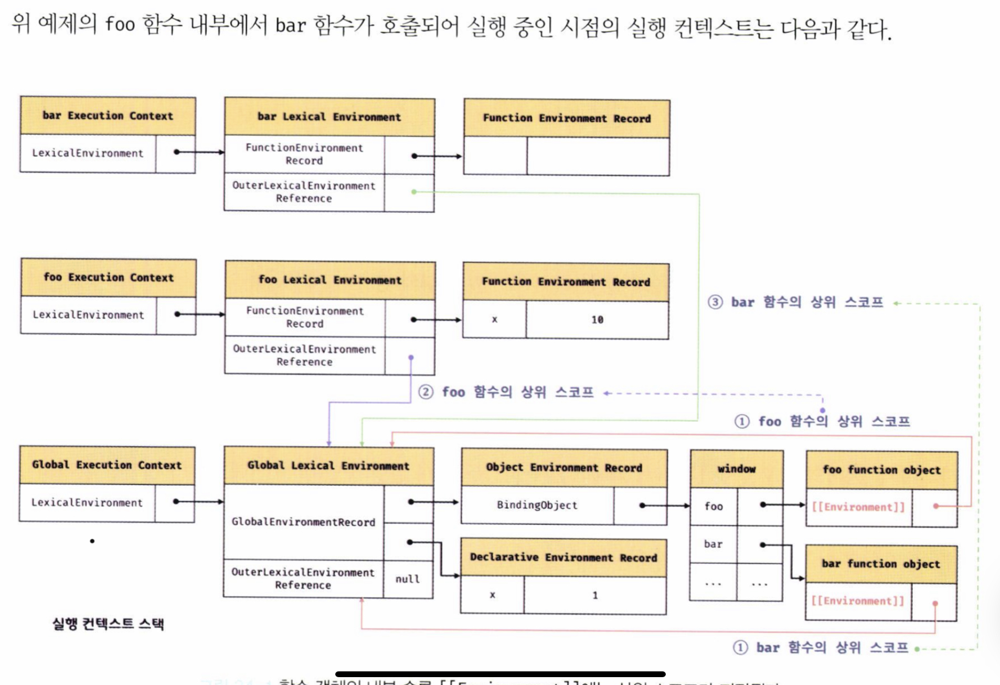
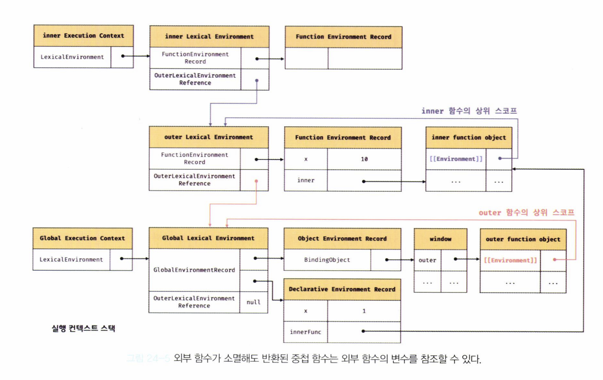

# P388 ~ P401

함수를 일급 객체로 취급하는 함수형 프로그래밍 언어에서 사용되는 이 클로저는 그리 어렵지 않습니다 !!

> 클로저는 함수와 그 함수가 선언되어있는 렉시컬 환경과의 조합이다.

```jsx
function outer() {
  const x = 1;
  function inner() {
    console.log(x); // 1
  }
  inner();
}
outer();
```

inner의 상위 스코프는 outer의 함수 스코프이다. 그렇기 때문에 중첩함수 inner는 외부 스코프에 정의된 x 변수에 접근할 수 있다.

자바스크립트는 렉시컬 스코프을 따르기 때문에 (호출된 곳이 아닌 자신이 선언된 곳에서의 스코프를 따른다.)

```jsx
const x = 1;
function outer() {
  const x = 10;
  inner();
}
function inner() {
  console.log(x); // 1
}
outer();
```

위와 같은 결과를 보이게 된다.

## 1. 렉시컬 스코프란 ??

자바스크립트 엔진은 어디서 호출했는지가 아니라 함수를 어디에 정의했는지에 따라 상위 스코프를 결정한다. -> 정적스코프(렉시컬 스코프)라 부른다.

**스코프의 실체는 실행 컨텍스트의 렉시컬 환경이다.** 이 렉시컬 환경은 자신의 `외부 렉시컬 환경에 대한 참조`를 통해 상위 렉시컬 환경과 연결된다. -> 이를 스코프 체인이라 부른다.

렉시컬 환경의 `외부 렉시컬 환경에 대한 참조` 값은 함수 정의가 평가되는 시점에 함수가 정의된 환경에 의해 결정된다. 이것이 바로 **렉시컬 스코프**이다.

## 2. 함수 객체의 내부 슬롯

정의된 환경과 호출된 환경은 다를 수 있습니다. 따라서 렉시컬 스코프가 가능하려면 자신이 호출되는 환경과는 상관없이 자신이 정의된 환경을 (상위 스코프)를 기억해야합니다. 함수는 자신의 내부 슬롯 `Environment`에 자신이 정의된 환경에 대한 참조를 저장합니다.

**자신이 정의된 환경에 대한 참조를 함수 객체의 내부 슬롯에 저장한다.(현재 실행 중인 실행 컨텍스트의 렉시컬 환경을 가리킨다)**

**함수 객체는 상위 스코프의 실행 컨텍스트가 실행 중일때 생성되며(혹은 상위 스코프 소스코드 평가 시점에), 생성될 때 실행 중인 실행 컨텍스트가 함수 객체의 내부슬롯에 저장되는 참조 값이다.**

자신이 존재하는 한 상위 스코프를 기억한다!!

```jsx
const x = 1;

// foo 함수 객체는 자신의 상위 스코프인 전역 렉시컬 환경 참조 값을 Environment에 저장한다.
function foo() {
  const x = 10;

  bar();
}

// bar 함수 객체는 자신의 상위 스코프인 전역 렉시컬 환경 참조 값을 Environment에 저장한다.
function bar() {
  console.log(x); // 1
}

foo(); // 1
bar(); // 1
```

위 코드는 다음 사진과 같이 설명된다.



### Q1. 사진을 보고 의아한 점

실행컨텍스트에서 자신이 선언된 위치에서의 상위 스코프 (상위 실행컨텍스트가 가리키는 렉시컬 환경)을 참조할 수 있는데 굳이 함수 객체에 `Environment`에도 상위 스코프 참조값을 저장해야하는가 ?

### Q2. 함수 정의가 평가되는 시점 (전역 코드가 평가되는 시점에) 실행 중인 실행 컨텍스트의 렉시컬 환경인 전역 렉시컬 환경의 참조가 저장된다.

함수가 호출되면, 함수 내부로 제어권이 이동한다. 그리곤 함수 코드를 평가하기 시작하는데, 아래 순서로 진행된다. (복습)

1. 함수 실행 컨텍스트가 생성된다.
2. 함수 렉시컬 환경이 생성된다. (함수 환경 레코드 + this 바인딩 + 외부 렉시컬 환경에 대한 참조값 저장)

외부 렉시컬 환경에 대한 참조 값을 저장할 때, 함수 객체가 갖는 Environment 내부 슬롯의 값을 가져와 저장한다. 결국 바로 함수가 정의된 곳의 상위 스코프가 저장되며, 이 것이 바로 함수 정의 위치에 따라 상위 스코프를 결정하는 렉시컬 스코프의 실체이다.

## 3. 클로저와 렉시컬 환경

```jsx
const x = 1;

function outer() {
  const x = 10;
  const inner = function () {
    console.log(x); // 10
  };
  return inner;
}
const inner = outer();
inner();
```

outer 함수는 중첩 함수 inner를 반환하고 생명 주기를 마감한다. (실행 컨텍스트 스택에서 제거된다) 하지만 `inner` 함수에 의해 생명 주기가 종료된 함수 내부의 지역 변수에 접근이 가능하다.

**이 처럼 외부 함수보다 중첩함수가 더 오래 유지되는 경우 중첩 함수는 이미 생명 주기가 종료한 외부 함수의 변수를 참조할 수 있다. -> 이러한 중첩함수를 클로저라고 한다.**

outer 함수의 실행 컨텍스트가 종료된다고 해서 outer 함수의 렉시컬 환경까지 소멸하는 것은 아니다!!!

`inner`가 렉시컬 환경을 가리키고 있으므로 가비지 컬렉터에 의해 사라지지 않는다.


여기서 `inner` 함수를 호출하면 다음과 같은 그림이 된다.



**결국 Inner함수는 외부함수보다 오래 생존했고, 외부 함수의 내부 변수들의 값을 변경할 수도 있고 참조할수도있다.**

1. 중첩함수이지만, 외부함수보다 일찍 소멸하는 경우 클로저가 아니다.

2. 중첩함수이지만, 상위 스코프의 어떤 식별자도 참조하지 않는다면 이는 클로저가 아니다.

3. 중첩함수가 외부 함수보다 오래 유지되고, 상위 스코프의 식별자를 참조하고 있으면 클로저다.

**일반적으로 클로저는 중첩함수가 상위 스코프의 식별자를 참조하고, 외부 함수보다 오래 유지되는 경우로 한정된다**

# P401 ~ 416

## 1. 클로저는 어디에 활용될 수 있을까요?

클로저는 상태를 안전하게 변경하고 유지하기 위해 사용한다.

**상태를 안전하게 은닉하고 특정 함수에게만 상태 변경을 허용한다.**

빅터와 나의 방식 -:> 캐시스토어는 은닉화하고 메소드들로만 캐시 스토어의 데이터를 변경한다 !!! 우리가 잘 활용한거다!!

캐시스토어를 3가지 방법으로 구현해보자

### 1. 클로저를 활용하여 구현

```jsx
export const { getCacheData, setCacheData } = (function () {
  // cache store의 상태를 은닉화할 수 있다.
  const cacheStore = {};
  const timeoutList = {};
  return {
    // getCacheData - setCacheData (cacheStore의 데이터를 변경할 수 있는건 이 메소드들뿐이다)
    getCacheData(cacheKey) {
      return cacheStore[cacheKey];
    },
    setCacheData(cacheKey, data) {
      if (timeoutList[cacheKey]) {
        clearTimeout(timeoutList[cacheKey]);
      }
      timeoutList[cacheKey] = setTimeout(() => {
        cacheStore[cacheKey] = undefined;
      }, REVALIDATION_TIME);
      cacheStore[cacheKey] = data;
    },
  };
})();
```

만약 위 방식이 다음과 같은 방식이라면 다음의 문제가 생기게된다.

### 2. 클로저가 아니라 다음과 같은 방식이라면?

```jsx
const cacheStore = {};

function setCacheData(key, data) {
  cacheStore[key] = data;
}

setCacheData("key", 10);
setCacheData("key", 20);
setCacheData("key", 30);
```

**누구나 접근할 수 있는 전역변수이기 때문에 의도치 않게 상태가 변경될 수 있다.**

캐시 스토어의 데이터를 안전하게 변경하고, 유지하고자 한다면 클로저 패턴을 활용해볼 수 있다!!

### 3.클로저가 아니어도 은닉화는 할 수 있다.

```jsx
/* instance가 여러개 생성되어도 된다면 */
class CacheStoreClass {
  #cacheStore;

  set(key, data) {
    // ...
  }
}
```

```jsx
// cacheStore.js

/* instance가 한개만 생성되어야 한다면 */
class CacheStoreClass {
  #cacheStore;

  set(key, data) {
    // ...
  }
}

export default new CacheStoreClass();
```

## 2. 클로저로 만들어 보는 Counter !

### 2-1. 클로저가 아닌 방식

```jsx
const increase = function () {
  let num = 0; // 호출될때마다 초기화된다.
  return ++num;
};
increase(); // 실제 : 1 === 기대 값: 1
increase(); // 실제 : 1 !== 기대 값: 2
increase(); // 실제 : 1 !== 기대 값: 3
```

num이 지역변수이기 때문에 은닉화에는 성공하였으나 상태가 변경되기 이전의 상태를 유지하지 못하기 때문에 정상적으로 동작하지 않는다.

### 2-2 클로저 방식

```jsx
const increase = (function () {
  let num = 0;

  return function () {
    // 자신이 정의된 위치에서의 상위 스코프 (즉시실행함수)를 기억하므로 + 상위 스코프의 변수를 사용하므로 클로저다.
    return ++num;
  };
})();

increase(); // 실제 : 1 === 기대 값: 1
increase(); // 실제 : 2 === 기대 값: 2
increase(); // 실제 : 3 === 기대 값: 3
```

클로저를 활용하면 지역변수를 은닉화할수도 있고, 이전 상태를 유지할 수도 있다. (기대했던 모듈을 구현할 수 있다.) **이 처럼 클로저는 상태가 의도치 않게 변경되지 않도록 안전하게 은닉하고 특정 함수에게만 상태 변경을 허용하여 상태를 안전하게 변경하고 유지하기 위해 사용된다**

```jsx
const counter = (function () {
  let num = 0;
  return {
    inc() {
      // 메소드가 평가되는 시점에 실행 중인 실행 컨텍스트인 즉시 실행 함수의 실행 컨텍스트 렉시컬 환경을 가리킨다.
      return num++;
    },
    dec() {
      return num--;
    },
  };
})();
counter.inc(); // 1
counter.dec(); // 0
```

싱글턴한 객체가 생성!

### 2-2 클로저와 프로토타입 기능을 활용하여 만들어보자!

```jsx
const Counter = (function () {
  // 외부에서 감춰진다.
  let num = 0;

  function Counter() {
    // this.num = 0; 이라면 어디서든 접근이 가능..
  }

  Counter.prototype.inc = function () {
    // 함수 정의가 평가되어 함수 객체가 생성될 때 실행 중인 실행 컨텍스트의 렉시컬 환경을 기억한다.(즉시실행함수 실행 컨텍스트의 렉시컬 환경)
    return ++num;
  };
  Counter.prototype.dec = function () {
    return --num;
  };
  return Counter();
})();

const counter = new Counter();

counter.inc(); // 1
counter.dec(); // 0
```

## 3. 캡슐화와 정보은닉

캡슐화 - 객체의 상태를 나타내는 프로퍼티와 프로퍼티를 참조하고 조작할 수 있는 동작인 메소드를 하나로 묶는 것을 말한다.

정보은닉 - 특정 프로퍼티나 메소드를 감추는 것

정보은닉은 외부에 공개할 필요가 없는 구현의 일부를 외부에 공개되지 않도록 감추어 적절치 못한 접근으로부터 객체의 상태가 변경되는 것을 방지해 정보를 보호하고, 객체 간의 상호 의존성, 즉 결합도를 낮출 수 있다. (자신의 동작만 할 수 있도록 모듈화할 수 있구나!!)

흠흠.. 메소드와 프로퍼티가 공개적이면, 다른 객체에서도 이를 참조하고 사용할 수 있다는 것이니 상호의존성이 낮음을 보장할 수 없겠군.
