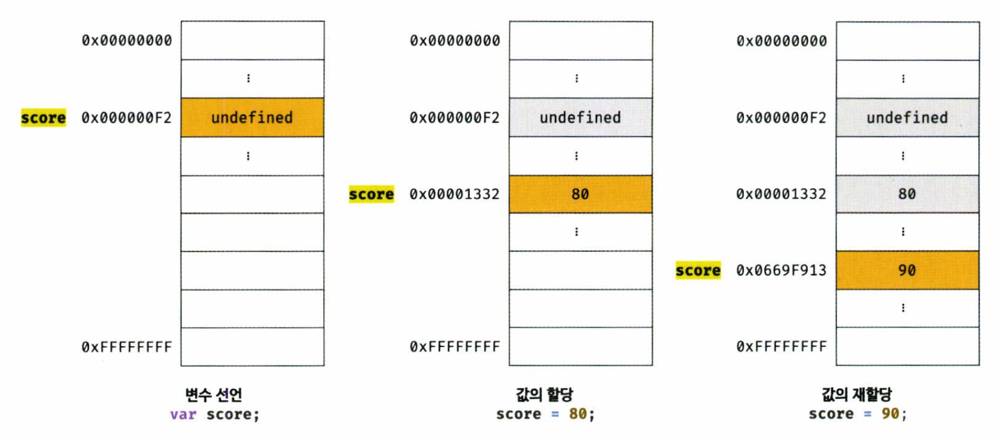
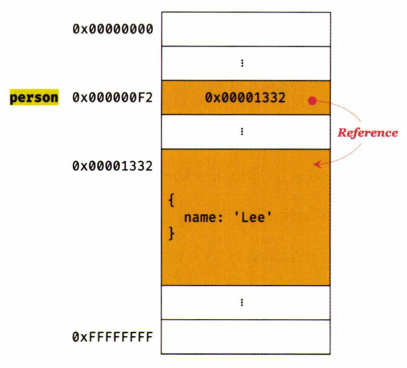
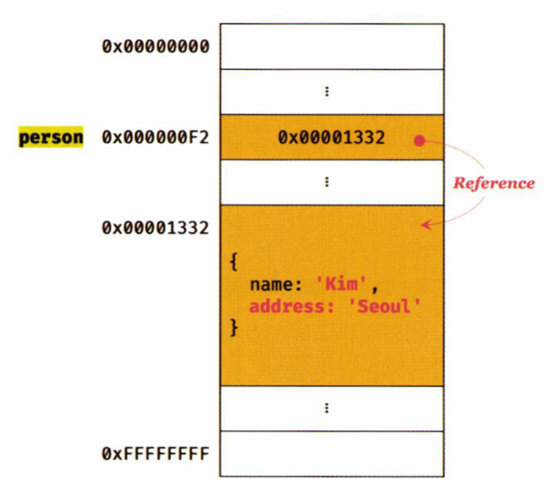
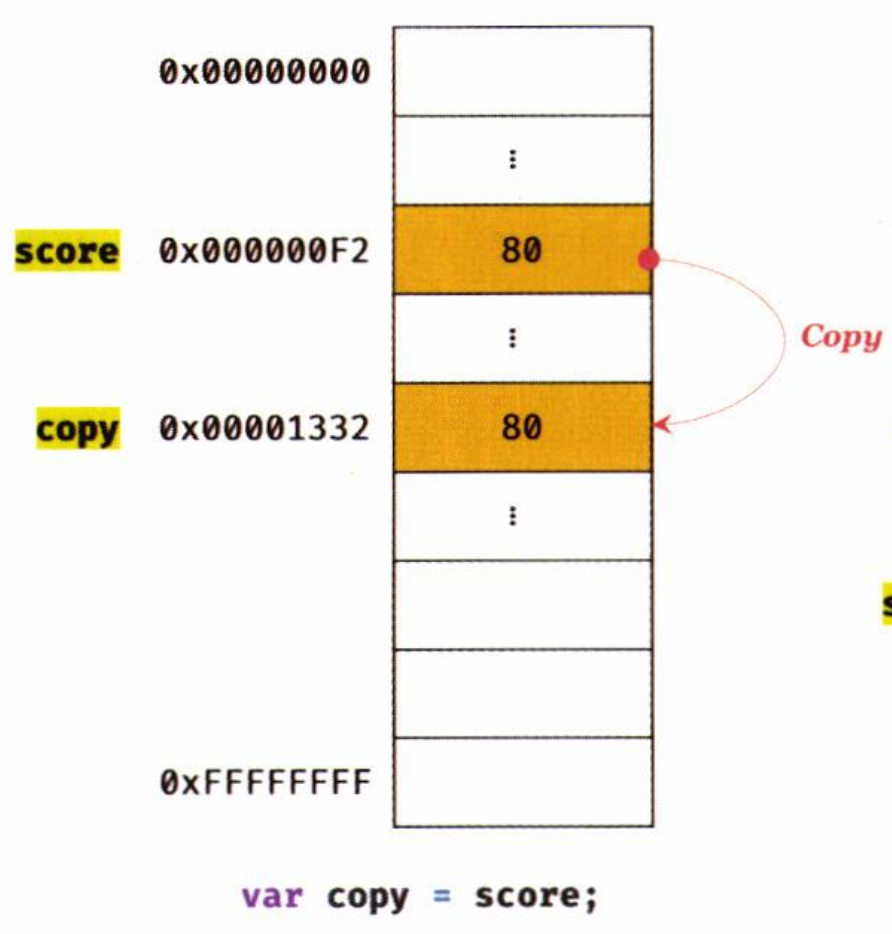
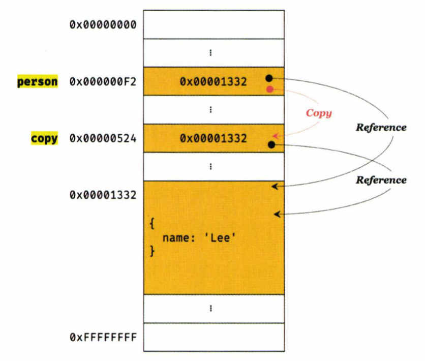

### Chapter 11. 원시 값과 객체의 비교

---

#### 서론. 원시 타입과 객체 타입은 뭐가 다를까?

앞에서, 자바스크립트의 타입은 크게 `원시(primitive)타입`과 `객체(reference)타입`으로 나뉘는 것을 배웠다.
나눴다는 것은 다른 점이 존재한다는 것으로 애기할 수 있다. 지금부터 한번 알아보겠다.

<br>

#### 본론. 원시 값과 객체

- **원시 값**

  - 원시 값이란, 원시타입의 값을 의미한다. 원시 값은 `변경 불가능한 값`이다.

    ```javascript
    var score = 80;
    score = 90;
    ```

    아주 간단한 코드이다. 자바스크립트 엔진이 위 코드를 해석하는 순서는 어떻게 될까?

    1. score 변수를 선언함과 동시에 undefined로 초기화 한다(var의 특성) - 런타임 이전
    2. score 변수에 80이라는 값을 할당한다. - 런타임
    3. score 변수에 90이라는 값을 할당한다. - 런타임

    <br>

    위 과정을 그림으로 나타내면 아래와 같다.
    

    사진에서 보이듯이, `score = 90;`에서 80이라는 값 자체가 90으로 바뀔 것으로 예상할 수 있으나, 그렇게 동작하지 않는다. 80이라는 값은 메모리상에 여전히 남아있고, 90이라는 값이 담겨있는 메모리를 가리키게 되는
    것이다. 이러한 특성을 **불변성**이라 한다.

<br>

- **객체**

  - 객체란, 객체 타입의 값을 의미한다. 객체는 `변경 가능한 값`이다.

  ```javascript
  //1번
  var person = {
    name: "Lee",
  };

  //2번
  person.name = "Kim";
  person.address = "Seoul";
  ```

  <br>
  위 코드를 그림으로 나타내면 아래와 같다.
  <p align="center">
  
  
  </p>

  사진에서 보이듯이, 1번 코드와 2번 코드에서 person이 가리키고 있는 메모리의 값(0x00001332)이 동일하다.
  이 말은, 가리키고 있는 대상이 같다는 말이다. 2번의 코드로 인해, 가리키고 있는 대상에 프로퍼티를 추가를 하여 변화를 가하였다. 즉, 객체는 `변경 가능한 값`이다.

<br>

> **그렇다면, 왜 객체는 변경 가능한 값으로 설계를 하였을까?**
> 불변성으로 설계 되었다면, 값이 바뀔때 마다 이전 값을 복사해서 새롭게 생성해야 되는데 이 과정이 메모리를 많이 소비하기 때문에, 메모리 사용의 효율성과 성능을 위해 변경 가능한 값으로 설계된 것이다.

<br>

- **copy**

  - 원시 값을 copy하는 경우
    <p align="center">
      
    </p>

  <br>

  - 객체를 copy하는 경우
    <p align="center">
      
    </p>

위 두가지 방식에서 알 수 있듯이, 변수가 기억하는 메모리 공간에 저장되어 있는 값을 복사한다!

<br>

- 자바스크립트 객체의 관리 방식
  - 자바스크립트 객체는 프로퍼티 키를 인덱스로 사용하는 해시 테이블이라고 생각할 수 있다.
  - V8 자바스크립트 엔진에서는 프로퍼티에 접근하기 위해 **동적 탐색 대신 히든 클래스**라는 방식을 사용한다.
  - 히든 클래스란? [https://engineering.linecorp.com/ko/blog/v8-hidden-class/](https://engineering.linecorp.com/ko/blog/v8-hidden-class/)
  - 히든 클래스를 가볍게 정리한다면, 객체의 프로퍼티 값을 참조할 때의 속도 저하를 막기 위한 장치라고 생각하면 좋을 것 같네요.

<br>

#### 결론.😄

**원시 값은 변경 불가능한 값이다. 객체는 변경 가능한 값이다.**
