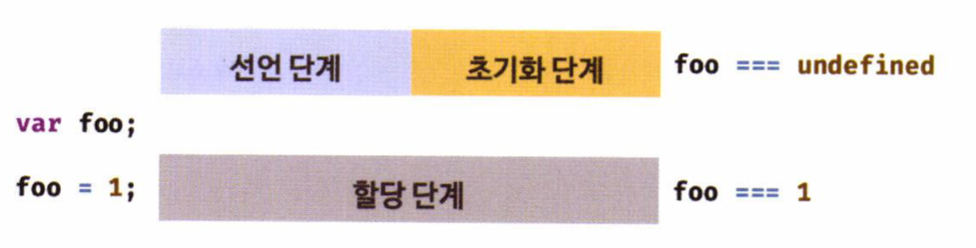

## Chapter 15. let, const 키워드와 블록 레벨 스코프

---

### 1. var 키워드로 선언한 변수의 문제점

- ES5까지 변수를 선언할 수 있는 유일한 방법은 var 키워드를 사용하는 것이었다.
- var 키워드는 주의를 기울이지 않으면 심각한 문제를 발생시킬 수 있는 독특한 특징들이 있다.

<br>

- **변수 중복 선언 허용**

  ```jsx
  var x = 1;
  var y = 1;

  //1번
  var x = 100;

  //2번
  var y;

  console.log(x); // 100
  console.log(y); // 1
  ```

  - 1번 : 초기화문이 있는 변수 선언문은 JS 엔진에 의해 var 키워드가 없는 것처럼 동작한다.
  - 2번 : 초기화문이 없는 변수 선언문은 무시된다.
  - 😈해당 특징은 의도치 않게 먼저 선언된 변수 값을 변경할 수 있는 위험도가 존재한다.

<br>

- **함수 레벨 스코프**
  - 오로지 함수의 코드 블록만을 지역 스코프로 인정한다.
  - 😈해당 특징은 전역 변수를 남발할 수 있는 위험도가 존재한다.

<br>

- **변수 호이스팅**

  ```jsx
  //1번
  console.log(foo); // undefined

  foo = 123;

  //2번
  console.log(foo); // 123

  var foo;
  ```

  - 1 ~ 2번을 출력해도 아무런 오류가 발생하지 않는다.
  - 😈해당 특징은 코드의 흐름을 파악하기 힘들고, 오류를 발생시킬 수 있는 위험도가 존재한다.

<br>

- 위에서 언급한 var 키워드의 단점을 보완하기 위해, ES6에 **`let, const`** 키워드가 도입되었다.🎉

<br>

### 2. let 키워드의 특징

- **변수 중복 선언 금지**

  ```jsx
  let bar = 123;
  let bar = 456; // SyntaxError: Identifier 'bar' has already been declared
  ```

<br>

- **블록 레벨 스코프**

  ```jsx
  let foo = 1;

  {
    let foo = 2;
    let bar = 3;
  }

  console.log(foo); // 1
  console.log(bar); // ReferenceError: bar is not defined
  ```

<br>

- **변수 호이스팅**

  ```jsx
  console.log(foo); // ReferenceError: foo is not defined
  let foo;
  ```

  - 위 예시를 보면, let 키워드는 호이스팅이 일어나지 않는 것 처럼 보인다.
  - 실제로는 호이스팅이 일어난다! 그러면, 왜 `ReferenceError`가 나오는지 알아보자🎯

<br>

- **var 키워드 동작 방식**

  ```jsx
  //런타임 이전에 선언 단계와 초기화 단계 실행

  //1번
  console.log(foo); // undefined

  var foo;

  //할당 단계 실행
  foo = 1;
  console.log(foo); // 1
  ```

  - 1번의 결과는 undefined이다.
  - 즉, **var 키워드로 선언한 변수는 런타임 이전에 선언 단계와 초기화 단계가 실행된다.**

  <p align="center">
    
  </p>

<br>

- **let 키워드 동작 방식**

  - let 키워드로 선언한 변수는 `선언 단계`와 `초기화 단계`가 분리되어 진행된다.
  - 만약 초기화 단계가 실행되기 이전에 변수에 접근하려고 하면 `ReferenceError`가 발생한다.
  - 스코프의 시작 지점부터 초기화 시작 지점까지 변수를 참조할 수 없는 공간을 **일시적 사각 지대(TDZ)** 라고 부른다.

    ```jsx
    //런타임 이전에 선언 단계 실행

    console.log(foo); // ReferenceError: foo is not defined

    let foo; // 초기화 단계 실행
    console.log(foo); // undefined

    foo = 1; // 할당 단계가 실행
    console.log(foo); // 1
    ```

<br>

  <p align="center">
    
  </p>

<br>

### 3. const 키워드

> 들어가기 전...<br>
> const 키워드의 특징은 let 키워드와 대부분 동일하므로 let 키워드와 다른 점을 중심으로 설명하겠다.

<br>

- **반드시 선언과 동시에 초기화해야 한다.**
  ```jsx
  const foo; // SyntaxError: Missing initializer in const declaration
  ```

<br>

- **재할당이 금지된다.**
  ```jsx
  const foo = 1;
  foo = 2; // TypeError: Assignment to constant variable.
  ```

<br>

- **상수를 표현하는 데 사용한다.**

  ```jsx
  const PI = 3.14;
  const MAX_NAME_LENGTH = 10;
  ```

<br>

### 4. 결론🔥

변수 선언에는 기본적으로 const를 사용하고, let은 재할당이 필요한 경우에 한정해 사용하는 것이 좋다.
