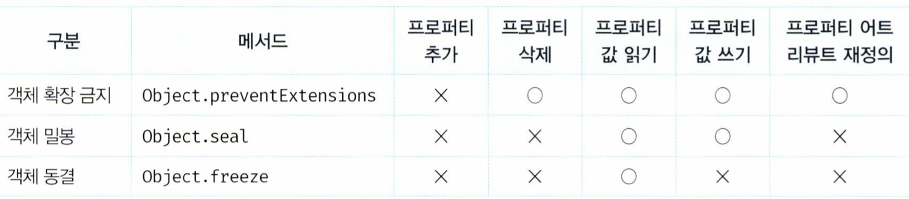

## Chapter 16. 프로퍼티 어트리뷰트

---

### 1. 내부 슬롯과 내부 메서드의 정의

- 어려운 정의(미리 말하지만, 말이 어려워요😂)

  - 내부 슬롯과 내부 메서드는 JS 엔진의 구현 알고리즘을 설명하기 위해 ECMAScript 사양에서 사용하는 의사 프로퍼티와 의사 메서드다.
    <br>

- 훨씬 쉬운 정의👍
  - 이중 대괄호 `[[...]]`로 감싼 이름들이 내부 슬롯과 내부 메서드다.
    <br>

### 2. 내부 슬롯과 내부 메서드의 특징

- 이해하기 어려운 말😂
  - 내부 슬롯과 내부 메서드는 JS 엔진의 내부 로직이다.
  - 그렇기에, **원칙적으로 JS는 내부 슬롯과 내부 메서드에 직접적으로 접근하거나 호출할 수 있는 방법을 제공하지 않는다.**
  - But, 일부 내부 슬롯과 내부 메서드에 한하여 간접적으로 접근할 수 있는 수단을 제공한다.

<br>

- 예제를 보면서, 어려운 말을 이해해보자🔥

  - **내부 슬롯과 메서드에는 직접적으로 접근할 수 없어요!!**

    ```jsx
    const crew = { name: "lokba" };

    console.dir(crew); //결과를 확인하면, [[Prototype]]이라는 내부 슬롯이 있다.

    //ok, 좋아! [[Prototype]]에 접근해보자.
    crew[[Prototype]]; //Uncaught SyntaxError: Unexpected token '['

    //결론 : 내부 슬롯과 메서드에는 직접 접근을 할 수 없다!
    ```

  - **일부 내부 슬롯과 내부 메서드는 간접적으로 접근할 수 있어요!**

    ```jsx
    const crew = { name: "lokba" };

    //__proto__를 통해 [[Prototype]]에 접근할 수 있다.
    console.log(crew.__proto__);
    ```

    <br>

  - **멈춰! `__proto__`는 deprecated 되었어요!** 이 [링크](https://developer.mozilla.org/ko/docs/Web/JavaScript/Reference/Global_Objects/Object/proto)를 보세요👁

    ```jsx
    const crew = { name: "lokba" };

    //__proto__와 동일한 결과를 반환해!
    console.log(Object.getPrototypeOf(crew));

    //결론: 앞으로, Object.getPrototypeOf()을 사용하세요!
    ```

<br>

### 3. 프로퍼티 어트리뷰트와 프로퍼티 디스크립터 객체

- 소제목부터 어렵죠? 근데 간단한 내용이에요!
- 이해하기 어려운 말😂
  - JS 엔진은 프로퍼티를 생성할 때, 프로퍼티의 상태를 나타내는 프로퍼티 어트리뷰트를 기본값으로 자동 정의해요.
  - 여기서, 프로퍼티의 상태에는 여러 종류가 있어요.
    - **value** - 프로퍼티의 값
    - **writable** - 값의 갱신 가능 여부
    - **enumerable** - 열거 가능 여부
    - **configurable** - 재 정의 가능 여부
  - 프로퍼티 상태와 연관되게 내부 슬롯(프로퍼티 어트리뷰트)도 여러 종류가 있어요.
    - **`[[Value]]`**
    - **`[[Writable]]`**
    - **`[[Enumerable]]`**
    - **`[[Configurable]]`**

<br>

- 예제를 보면서, 어려운 말을 이해해봐요🔥

  - **crew 객체의 name 프로퍼티 어트리뷰트를 접근해보자.**

    ```jsx
    const crew = { name: "lokba" };

    crew[[Value]]; //Uncaught SyntaxError: Unexpected token '['
    ```

    <br>

  - **맞아요! 프로퍼티 어트리뷰트는 내부 슬롯이기에, 직접적으로 접근할 수 없어요. 간접적으로 제공해주는 `Object.getOwnPropertyDescriptor` 메서드를 사용해보자!!**

    ```jsx
    const crew = { name: "lokba" };

    Object.getOwnPropertyDescriptor(crew, "name");
    //{value: 'lokba', writable: true, enumerable: true, configurable: true}

    // 오호, 프로퍼티 상태에는 value, writable, enumerable, configurable이 있군요!!
    ```

    <br>

  - **Object.getOwnPropertyDescriptor 메서드에 대해 좀 더 알아보자.**
    - 해당 메서드는 프로퍼티 어트리뷰트 정보를 제공하는 `프로퍼티 디스크립터 객체`를 반환한다고 해요.

  <br>

  - **추가로, ES8에는 Object.getOwnPropertyDescriptors 메서드가 도입되었어요!!** (이후에 이걸 어떻게 써먹을 수 있는지 알려줄게요😁)

    ```jsx
    const crew = { name: "lokba", description: "handsome" };

    Object.getOwnPropertyDescriptors(crew);
    //{name: {…}, description: {…}}
    ```

<br>

### 4. 데이터 프로퍼티와 접근자 프로퍼티

- 프로퍼티는 데이터 프로퍼티와 접근자 프로퍼티로 구분된다고 해요.
  - **데이터 프로퍼티** : 키와 값으로 구성된 일반적인 프로퍼티.
  - **접근자 프로퍼티** : **자체적으로는 값을 갖지 않고**, 다른 데이터 프로퍼티의 값을 읽거나 저장할 때 호출되는 접근자 함수로 구성된 프로퍼티.

<br>

- **데이터 프로퍼티**

  - 지금까지 살펴본 예시가 전부 데이터 프로퍼티라고 할 수 있어요.
  - 한번 더 살펴보자.

    ```jsx
    const crew = { name: "lokba" };

    Object.getOwnPropertyDescriptor(crew, "name");
    //{value: 'lokba', writable: true, enumerable: true, configurable: true}
    ```

  - 예시에서 볼 수 있듯이, 데이터 프로퍼티는 아래와 같은 프로퍼티 어트리뷰트를 가지고 있어요.
    - **`[[Value]]`**
    - **`[[Writable]]`**
    - **`[[Enumerable]]`**
    - **`[[Configurable]]`**

<br>

- **접근자 프로퍼티**

  - 예시를 통해 살펴보자.

    ```jsx
    const crew = {
      name: "김상록",
      nickname: "lokba",

      get profile() {
        return `name : ${this.name}, nickname : ${this.nickname}`;
      },

      set profile(value) {
        [this.name, this.nickname] = value.split(" ");
      },
    };

    Object.getOwnPropertyDescriptor(crew, "profile");
    //enumerable: true, configurable: true, get: ƒ, set: ƒ}
    ```

  - 예시에서 볼 수 있듯이, 접근자 프로퍼티는 아래와 같은 프로퍼티 어트리뷰트를 가지고 있어요.
    - **`[[Get]]`**
    - **`[[Set]]`**
    - **`[[Enumerable]]`**
    - **`[[Configurable]]`**

<br>

- 호호, 데이터 프로퍼티와 접근자 프로퍼티에 대해서 배웠는데, 여기서 퀴즈를 내볼게요. 1 ~ 3번은 어떤 형태로 출력이 될까요?🤔

  ```jsx
  const crew = {
    name: "김상록",
    nickname: "lokba",

    get profile() {
      return `name : ${this.name}, nickname : ${this.nickname}`;
    },

    set profile(value) {
      [this.name, this.nickname] = value.split(" ");
      console.log(this);
    },

    getProfile() {
      return `name : ${this.name}, nickname : ${this.nickname}`;
    },

    setProfile(value) {
      [this.name, this.nickname] = value.split(" ");
      console.log(this);
    },
  };

  //1번(콘솔이 있다고 가정해주세요)
  Object.getOwnPropertyDescriptor(crew, "getProfile");

  //2번(콘솔이 있다고 가정해주세요)
  Object.getOwnPropertyDescriptor(crew, "setProfile");

  //3번(콘솔이 있다고 가정해주세요)
  Object.getOwnPropertyDescriptor(crew, "profile");
  ```

  - 정답

    ```jsx
    //1번
    Object.getOwnPropertyDescriptor(crew, "getProfile");
    //{writable: true, enumerable: true, configurable: true, value: ƒ}

    //2번
    Object.getOwnPropertyDescriptor(crew, "setProfile");
    //{writable: true, enumerable: true, configurable: true, value: ƒ}

    //3번
    Object.getOwnPropertyDescriptor(crew, "profile");
    //{enumerable: true, configurable: true, get: ƒ, set: ƒ}
    ```

    - 1 ~ 2번은 데이터 프로퍼티이고, 3번은 접근자 프로퍼티이에요.

<br>

### 5. 프로퍼티 정의

- **Object.defineProperty** 메서드를 이용해서 프로퍼티를 정의할 수 있어요.
- 예시를 통해, 사용법을 알아보자.

  ```jsx
  const crew = {};

  Object.defineProperty(crew, "name", {
    value: "lokba",
    writable: true,
    enumerable: true,
    configurable: true,
  });

  Object.defineProperty(crew, "age", {
    value: 26,
  });

  Object.getOwnPropertyDescriptor(crew, "name");
  //{value: 'lokba', writable: true, enumerable: true, configurable: true}

  Object.getOwnPropertyDescriptor(crew, "age");
  //{value: 26, writable: false, enumerable: false, configurable: false}
  ```

  <br>

- **Object.defineProperties** 메서드로 여러 프로퍼티를 한 번에 정의할 수 있어요!

  ```jsx
  const crew = {};

  Object.defineProperties(crew, {
    name: {
      value: "lokba",
      writable: true,
      enumerable: true,
      configurable: true,
    },
    age: {
      value: 26,
    },
  });

  console.log(crew); //{name: 'lokba', age: 26}
  ```

<br>

- **Object.defineProperties**와 **Object.getOwnPropertyDescriptors**의 콜라보

  ```jsx
  const crew = { name: "lokba", description: "handsome" };

  const copy = Object.defineProperties(
    {},
    Object.getOwnPropertyDescriptors(crew)
  );

  console.log(copy); //name: 'lokba', description: 'handsome'}
  console.log(crew === copy); //false
  ```

  - 결론 : 2개 메서드를 이용하면, 얕은 복사가 가능해진다.
  - 특별한 점 : getter/setter 접근자 프로퍼티 또한 복사가 된다.

<br>

### 6. 객체 변경 방지

- JS는 객체의 변경을 방지하는 다양한 메서드를 제공해요.
- 메서드마다 금지하는 강도가 다른데, 아래 표를 한번 볼게요.

<p align="center">
  
</p>

- 표만 봐도, 이해가 될 수 있지만 좀 더 자세하게 알아보자!
  <br>

- **1.객체 확장 금지** - Object.preventExtensions()

  - 확장이 금지된 객체는 프로퍼티 추가가 금지한다.

    ```jsx
    const person = { name: "Lee" };

    // 아직, person 객체는 확장이 금지된 객체가 아니에요.
    console.log(Object.isExtensible(person)); // true

    // person 객체의 확장을 금지 적용!!
    Object.preventExtensions(person);

    // 이제, person 객체는 확장이 금지된 객체에요.
    console.log(Object.isExtensible(person)); // false

    // 프로퍼티 추가가 금지된다.
    person.age = 20; // 무시. strict mode에서는 에러
    console.log(person); // {name: "Lee"}

    // 프로퍼티 정의에 의한 프로퍼티 추가도 금지된다.
    Object.defineProperty(person, "age", { value: 20 });
    // TypeError: Cannot define property age, object is not extensible
    ```

<br>

- **2.객체 밀봉** - Object.seal()

  - 밀봉된 객체는 읽기와 쓰기만 가능하다.

    ```jsx
    const person = { name: "Lee" };

    // 아직, person 객체는 밀봉(seal)된 객체가 아니에요.
    console.log(Object.isSealed(person)); // false

    // person 객체를 밀봉 적용!!
    Object.seal(person);

    // 이제, person 객체는 밀봉(seal)된 객체에요.
    console.log(Object.isSealed(person)); // true

    // 프로퍼티 추가가 금지된다.
    person.age = 20; // 무시. strict mode에서는 에러
    console.log(person); // {name: "Lee"}

    // 프로퍼티 삭제가 금지된다.
    delete person.name; // 무시. strict mode에서는 에러
    console.log(person); // {name: "Lee"}
    ```

<br>

- **3.객체 동결** - Object.freeze()

  - 동결된 객체는 읽기만 가능하다.

    ```jsx
    const person = { name: "Lee" };

    // 아직, person 객체는 동결(freeze)된 객체가 아니에요.
    console.log(Object.isFrozen(person)); // false

    // person 객체를 동결 적용!!!
    Object.freeze(person);

    // 이제, person 객체는 동결(freeze)된 객체에요.
    console.log(Object.isFrozen(person)); // true

    // 프로퍼티 추가가 금지된다.
    person.age = 20; // 무시. strict mode에서는 에러
    console.log(person); // {name: "Lee"}

    // 프로퍼티 삭제가 금지된다.
    delete person.name; // 무시. strict mode에서는 에러
    console.log(person); // {name: "Lee"}

    // 프로퍼티 값 갱신이 금지된다.
    person.name = "Kim"; // 무시. strict mode에서는 에러
    console.log(person); // {name: "Lee"}

    // 프로퍼티 어트리뷰트 재정의가 금지된다.
    Object.defineProperty(person, "name", { configurable: true });
    // TypeError: Cannot redefine property: name
    ```

<br>

- **4.불편 객체**

  - 지금까지 살펴 본 변경 방지 메서드들은 **얕은 변경 방지**입니다.
  - 그래서, 중첩 객체까지는 영향을 주지는 못해요.

    ```jsx
    const person = Object.freeze({
      name: "Lee",
      address: { city: "Seoul" },
    });

    console.log(Object.isFrozen(person)); // true
    // 중첩 객체까지 동결하지 못해..
    console.log(Object.isFrozen(person.address)); // false

    person.address.city = "Busan";
    console.log(person); // {name: "Lee", address: {city: "Busan"}}
    ```

  - 중첩 객체까지 영향을 주고싶다면, 재귀적으로 Object.freeze 메서드를 호출하면, 완벽한 불변 객체를 구현할 수 있어요.
