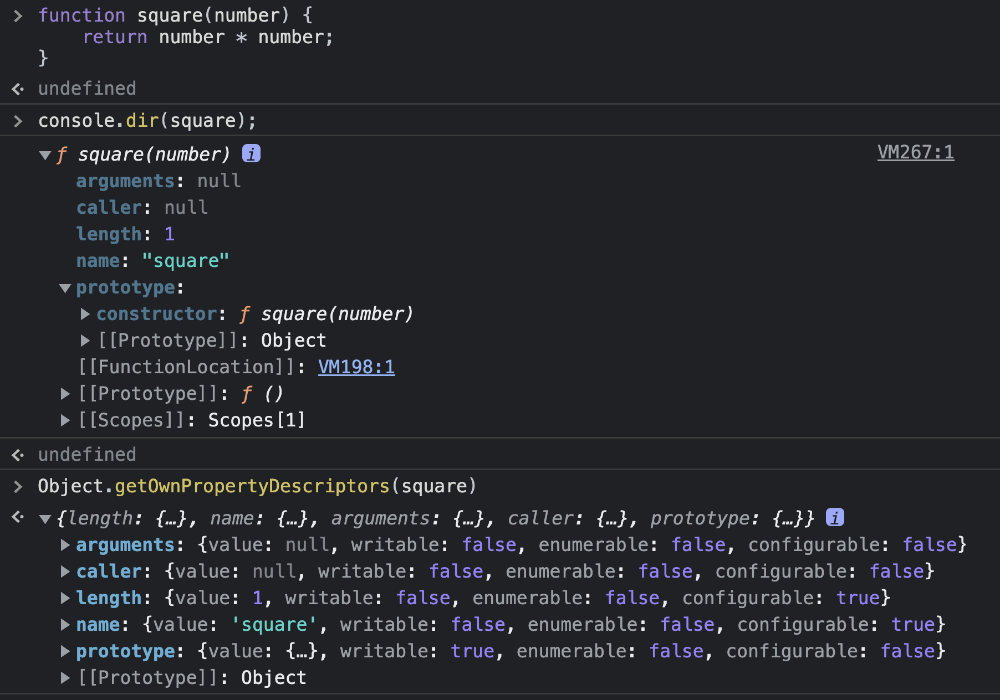

# 함수와 일급 객체

## 일급 객체

- 일급 객체의 조건
  - 1. 무명의 리터럴로 생성할 수 있다(=런타임에 생성 가능하다는 말)
  - 2. 변수나 자료구조(객체, 배열 등)에 저장할 수 있다.
  - 3. 함수의 매개변수에 전달할 수 있다.
  - 4. 함수의 반환값으로 사용할 수 있다.
- 함수는 객체이지만 일반 객체와는 차이가 있다.
  - 일반 객체는 호출할 수 없지만 함수 객체는 호출할 수 있다.
  - 그리고 함수 객체는 일반 객체에는 없는 `함수 고유의 프로퍼티`를 소유한다.(그게 뭔지는 이제 설명)

## 함수 객체의 프로퍼티

- 기억하자. `함수는 객체다.`
  - 따라서 객체인 함수도 `프로퍼티`를 가진다.(console.dir 메서드를 사용하면 함수 객체 내부 보기 쉽다)
  - 함수의 모든 프로퍼티 어트리뷰트는 `Object.getOwnPropertyDescriptors`로 확인할 수 있다. - `arguments`, `caller`, `length`, `name`, `prototype` 프로퍼티 모두 함수 객체의 데이터 프로퍼티다. - 반면, `[[Prototype]]`(또는 접근자 프로퍼티로서 `__proto__`)는 함수 객체 고유의 프로퍼티가 아니고, Object.prototype 객체의 프로퍼티를 상속받은 것이다.
    

### arguments 프로퍼티

- arguments 프로퍼티의 값은 arguments 객체다. 이 객체는 함수 호출 시 전달된 인수들의 정보를 담고 있는 iterable 유사 배열 객체\*다.
  - 이 arguments 객체는 함수 내부에서 지역 변수처럼만 사용할 수 있다.
  - (유사 배열 객체란 length 프로퍼티를 가진 객체로 for 문으로 순회할 수 있는 객체를 말한다. 다만, 배열이 아니므로 배열 메서드를 사용할 수 없고, 배열 메서드를 사용하려면 call이나 apply를 사용하여 간접 호출해야 한다)
    - 유사배열객체인 arguments 객체를 사용하기 번거롭다면, ES6에서는 배열 형태인 Rest 파라미터를 사용할 수 있다.
- arguments 객체는 매개변수 개수를 확정할 수 없는 가변 인자 함수를 구현할 때 유용하다.
  - 인수 개수가 매개변수 개수를 초과하더라도 버려지지 않고, 모든 인수는 암묵적으로 arguments 객체의 프로퍼티로 보관된다.

### caller 프로퍼티

- 함수 객체의 caller 프로퍼티는 함수 자신을 호출한 함수를 가리킨다
- caller 프로퍼티는 ECMAScript에 포함되지 않은 비표준 프로퍼티이다.

### length 프로퍼티

- 함수 객체의 length 프로퍼티는 함수를 정의할 때 선언한 매개변수의 개수를 가리킨다.

### name 프로퍼티

- 함수 객체의 name 프로퍼티는 함수 이름을 나타낸다.

### `__proto__` 접근자 프로퍼티

- 모든 객체는 [[Prototype]]이라는 내부 슬롯을 갖는다.
  - 그런데 내부 슬롯에 직접 접근할 수 없으므로, 간접 접근 방법으로 `__proto__` 접근자 프로퍼티를 통해 해당 프로토타입 객체에 접근할 수 있다.

```js
const obj = { a: 1 };

// 객체 리터럴 방식으로 생성한 객체의 프로토타입 객체는 Object.prototype이다.
console.log(obj.__proto__ === Object.prototype); // true

// 객체 리터럴 방식으로 생성한 객체는 프로토타입 객체인 Object.prototype의 프로퍼티를 상속받는다.
// hasOwnProperty 메서드는 Object.prototype의 메서드다.
console.log(obj.hasOwnProperty("a")); // true
console.log(obj.hasOwnProperty("__proto__")); // false
console.log(Object.prototype.hasOwnProperty("__proto__")); // true
```

### prototype 프로퍼티

- prototype 프로퍼티는 `생성자 함수로 호출할 수 있는 함수 객체(= constructor)`만이 소유하는 프로퍼티다.
  - 일반 객체와 생성자 함수로 호출할 수 없는 `non-constructor`에는 prototype 프로퍼티가 없다.
- `prototype 프로퍼티`는 함수가 객체를 생성하는 생성자 함수로 호출될 때, 생성자 함수가 생성할 `인스턴스의 프로토타입 객체`를 가리킨다.

```js
// 함수 객체는 prototype 프로퍼티를 소유한다.
(function () {}.hasOwnProperty("prototype")); // -> true

// 일반 객체는 prototype 프로퍼티를 소유하지 않는다.
({}.hasOwnProperty("prototype")); // -> false
```
