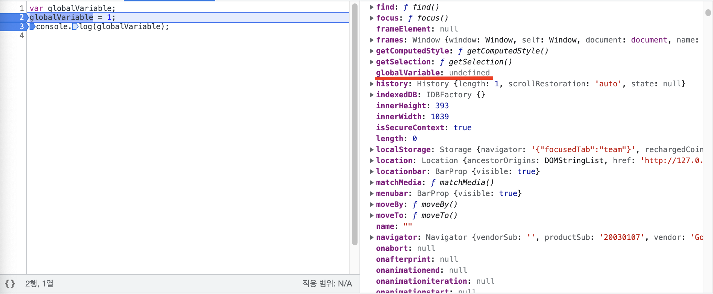
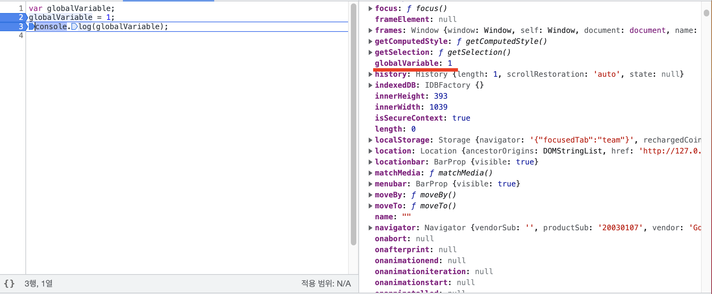
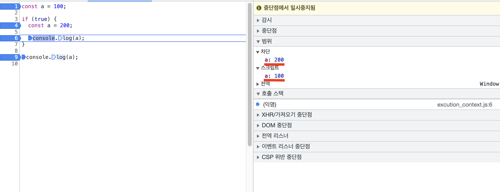

## 모던 자바스크립트 Deep Dive - Ch23 실행 컨텍스트
### 소스 코드의 평가와 실행
- 자바스크립트 엔진은 소스코드를 `소스코드 평가`와 `소스코드 실행` 과정으로 나누어 처리한다.
- 소스코드 평가 → 소스코드 실행 순으로 진행된다.

<br>

### 소스코드 평가
- 실행 컨텍스트 생성
- 변수 또는 함수의 선언문만 먼저 실행한다.
- 변수나 함수 식별자를 키로 렉시컬 환경 레코드(실행 컨텍스트가 관리하는 스코프)에 등록한다.

<br>

### 소스코드 실행
- 선언문을 제외한 코드 실행(런타임)
- 변수나 함수의 참조는 실행 스코프가 관리하는 스코프에서 검색을 통해 얻는다.
- 변수의 값 변경은 실행 컨텍스트가 관리하는 스코프에 등록
- 소스코드 평가 및 실행 예시
    - 예시 코드
    
    ```javascript
    var globalVariable;
    globalVariable = 1;
    console.log(globalVariable);
    ```
    
    - 2번 라인 실행 전
        - 전역 객체의 globalVariable에 undefined가 할당됐다.

        
    
    - 2번 라인 실행 후
        - 값 할당 부분의 코드가 실행된 후, 전역 객체의 globalVariable에 1이 할당됐다.
        
        

<br>

### 실행 컨텍스트의 역할 - 뭐 하는 녀석인가?

- 실행 컨텍스트는  소스 코드를 실행하는데 필요한 환경을 제공하고 코드의 실행 결과를 실제로 관리하는 영역
    
    → 실행 컨텍스트는 실행할 코드에 제공할 환경 정보들을 모아놓은 **객체**이다.
    
- 실행 컨텍스트는 식별자(변수, 함수, 클래스 등의 이름)을 등록하고 관리하는 **스코프**와  코드 실행 순서 관리를 구현한 **내부 메커니즘이다.**
- ~~실행 컨텍스트에는 3가지의 컴포넌트가 담긴다.~~
    - ~~ThisBinding 컴포넌트 → this binding 결정~~(확실하지 않음)
    - Lexical Environment  컴포넌트→ 식별자와 바인딩된 값 관리
    - Variable Environment 컴포넌트 → 식별자와 바인딩된 값 관리
- 모든 코드는 실행 컨텍스트를 통해 실행되고 관리된다.
    - 식별자와 스코프 관리 → **렉시컬 환경**으로 관리한다.
    - 코드 실행 순서 → **실행 컨텍스트 스택**(aka 콜 스택)으로 관리한다

> 책의 내용만 봐서는 실행 컨텍스트가 잘 와닿지 않아서 LMS의 문서 링크와 참고 자료 링크를 첨부합니다.
- [LMS 문서](https://techcourse.woowahan.com/s/dSWvXWYI/ls/sXTr8V17)
- [외부 참고 자료](https://medium.com/sjk5766/call-stack과-execution-context-를-알아보자-3c877072db79)
>

<br>

### 실행 컨텍스트 왜 필요한가?

1. 생성된 모든 식별자 들은 스코프를 구분하여 등록하고 상태 변화(식별자에 바인딩된 값의 변화)를 지속적으로 관리할 수 있어야 한다.
    - 예시 상황
        
        ```javascript
        const a = 100;
        
        if (true) {
          const a = 200;
        
          console.log(a); // 200
        }
        
        console.log(a); // 100
        ```
        
        - 같은 이름의 식별자 a가 스코프 별로 저장되어 있다.
        
        
        
2. 스코프 중첩 관계에 의해 스코프 체인을 형성해야한다.
    1. 만약, 현재 스코프에 없는 식별자를 참조한다면 상위 스코프로 이동하여 검색할 수 있어야한다.
    2. 참고 자료 [window.console](https://developer.mozilla.org/ko/docs/Web/API/Window/console)
    - 예시 상황
        
        ```javascript
        const testFunc = (a) => {
         // 함수 스코프에 console 식별자가 없지만, 상위 스코프로 검색을 하기 때문에
         // console.log()를 에러없이 사용할 수 있다.
        	console.log(a);
        }
        
        testFunc(100)
        ```
        
3. 현재 실행 중인 코드의 실행 순서를 변경(ex. 함수 호출에 의한 실행 순서 변경)할 수 있어야 하며 다시 되돌아갈 수도 있어야 한다.

### 실행 컨텍스트 스택 - 코드 실행 순서를 관리하는 스택 자료 구조
- 실행 컨텍스트 스택(콜 스택)의 최상위에 존재하는 실행 컨텍스트는 언제나 현재 실행 중인 코드의 실행 컨텍스트이다.
    - 스택의 최상위에 있는 실행 컨텍스트를 **실행 중인 실행 컨텍스트**라고 한다.

<br>

### 렉시컬 환경(Lexical Environment) - 식별자와 바인딩된 값을 관리하는 자료구조
- 렉시컬 환경은 식별자와 식별자에 바인딩된 값, 그리고 상위 스코프에 대한 참조를 기록하는 자료구조
    - 식별자를 key로하고 식별자에 바인딩된 값을 value로 관리
- 실행 컨텍스트를 구성하는 컴포넌트
- 렉시컬 환경은 두 개의 컴포넌트로 구성된다.
    - 환경 레코드(Environment Record)
        - 스코프에 포함된 식별자를 등록하고 등록된 식별자에 바인딩된 값을 관리하는 저장소
    - 외부 렉시컬 환경에 대한 참조(Outer Lexical Environment Reference)
        - 상위 스코프를 가리킨다.

<br>

### Lexical Environment 컴포넌트와 Variable Environment 컴포넌트
> 책에 Lexical Environment 컴포넌트와 Variable Environment 컴포넌트에 대해서 나와있지만, 잘 와닿지 않아서 [외부 자료](https://sambalim.tistory.com/155)를 참고했습니다.
> 
- 실행 컨텍스트가 처음 생성되면 Lexical Environment 컴포넌트와 Variable Environment 컴포넌트는 동일한 렉시컬 환경을 참조한다.
- 몇 가지의 특수한 상황에서 Lexical Environment 컴포넌트와 Variable Envrionment 컴포넌트의 내용이 달라진다.
    - 외부 참고 자료에서는 아래와 같이 설명합니다.
    
    > 소스코드를 평가하고 실행 컨텍스트를 만들때 LexicalEnvironment 컴포넌트와 VariableEnvironment 컴포넌트에는 같은 값이 담깁니다. 하지만 `catch` , `with` 에서 새로운 LexicalEnvironment 컴포넌트로 기존 LexicalEnvironment 를 바꾸어 VariableEnvironment 컴포넌트와 LexicalEnvironment 컴포넌트의 값이 달라지게됩니다.
    소스코드를 실행할때 변경된 LexicalEnvironment 컴포넌트에 없는 값을 VariableEnvironment 컴포넌트에서 찾고 이를 실행합니다.
    >

<br>

### 실행 컨텍스트 생성과 식별자 검색 과정

### 전역 객체 생성
- 전역 객체는 전역 코드가 평가되기 이전에 생성된다.
- 전역 객체에는 빌트인 전역 프로퍼티와 빌트인 전역 함수, 표준 빌트인 객체가 포함된다.
    - 빌트인 전역 프로퍼티
    - 빌트인 전역 함수
    - 표준 빌트인 객체
        - 브라우저의 경우 Web API가 여기에 포함된다.

<br>

### 전역 코드 평가
1. 전역 실행 컨텍스트 생성
2. 전역 렉시컬 환경 생성
    1. 전역 환경 레코드 생성
        1. 객체 환경 레코드 생성
        2. 선언적 환경 레코드 생성
    2. this 바인딩
    3. 외부 렉시컬 환경에 대한 참조 결정

### 전역 실행 컨텍스트 생성
❗️실행 컨텍스트 스택을 이후에는 콜 스택으로 명명하겠음
- 비어 있는 전역 컨텍스트를 생성하여 콜 스택에 푸시한다.

<br>

### 전역 렉시컬 환경 생성
- 전역 렉시컬 환경을 생성하고 전역 실행 컨텍스트를 바인딩한다.

<br>

### 전역 환경 레코드 생성
전역 환경 레코드는 `객체 환경 레코드`와 `선언적 환경 레코드`로 구성된다.
- 객체 환경 레코드
    - var 키워드로 선언한 전역 변수, 함수 선언문을 선언한 전역 함수, 빌트인 전역 프로퍼티와 빌트인 전역 함수, 표준 빌트인 객체 관리
- 선언적 환경 레코드
    - let, const 키워드로 선언한 전역 변수를 관리

`객체 환경 레코드`와 `선언적 환경 레코드`가 협력하여 전역 스코프와 전역 객체를 관리한다.

<br>

### 객체 환경 레코드 생성
- BindingObject라고 부르는 객체와 연결된다.
    - BindingObject는 생성된 전역 객체이다.
- var 키워드로 선언한 전역 변수와 함수 선언문으로 선언한 함수는 생성된 전역 객체에 등록된다.

<br>

### 선언적 환경 레코드 생성
- let, const 키워드로 선언한 전역 변수는 선언적 환경 레코드에 등록된다.

<br>

### this 바인딩
- 전역 환경 레코드의 내부 슬롯에 this가 바인딩됨
- 전역 코드에서 this는 전역 객체를 의미한다.
    - 즉, 전역 환경 레코드에 전역 객체가 바인딩 된다.

<br>

### 외부 렉시컬 환경에 대한 참조 결정
- 외부 렉시컬 환경은 상위 스코프를 의미한다.
- 하지만, 평가 중인 전역 코드는 상위 스코프가 존재하지 않으므로 전역 렉시컬 환경의 `외부 렉시컬 환경에 대한 참조`는 null이다.

<br>

### 전역 코드 실행
- 변수 할당문 함수 호출문을 실행하기 전에 식별자가 렉시컬 환경의 환경 레코드에 존재하는지 확인한다.
    - 현재 실행 컨텍스트의 렉시컬 환경을 시작으로 상위 스코프로 검색을 한다.
    - 즉, 현재 렉시컬 환경의 환경 레코드에 찾고있는 식별자가 존재하면 검색을 멈춘다.

<br>

### 함수 코드 평가
1. 함수 실행 컨텍스트 생성
2. 함수 렉시컬 환경 생성
    1. 함수 환경 레코드 생성
    2. this 바인딩
    3. 외부 렉시컬 환경에 대한 참조 결정

<br>

### 함수 실행 컨텍스트 생성
평가하는 함수의 실행 컨텍스트를 생성한다.
바로 콜스택에 푸쉬하지는 않고, 함수 렉시컬 환경이 완성되면 실행 컨텍스트에 푸쉬한다.

<br>

### 함수 렉시컬 환경 생성
함수의 렉시컬 환경을 생성하여 함수의 실행 컨텍스트에 바인딩한다.

<br>

### 함수 환경 레코드 생성
매개변수, arguments 객체, 함수 내부에서 선언한 변수들이 등록된다.

<br>

### this 바인딩

<br>

### 외부 렉시컬 환경에 대한 참조 결정
함수가 평가된 시점에 실행 중인 실행 컨텍스트의 렉시컬 환경의 참조가 할당된다.