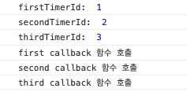
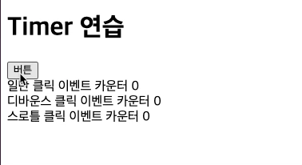

## 모던 자바스크립트 Deep Dive - Ch41 타이머
❗️자바스크립트 엔진은 싱글 스레드로 동작한다.
→ 한번에 하나의 작업만 수행이 가능하다.

<br>

### 호출 스케줄링 - 함수의 실행을 예약하는 방법
- 타이머 함수를 이용하면 일정 시간이 지난 후 특정 함수를 실행 가능하다.

<br>

### 타이머 함수
- javascript에서는 대표적인 타이머 함수는 `setTimeout`과 `setInterval` 가 있다.
- timer 함수에 대해서는 LMS [시간을 다루는 방법 챕터](https://techcourse.woowahan.com/s/dSWvXWYI/ls/TBq4XdaQ)에 잘 설명되어 있음

<br>

### setTimeout  - 일정 시간이 지난 후 콜백 함수를 한번 호출
- setTimeout은 단 한번 동작하는 타이머 생성
- 타이머가 만료되면 전달받은 콜백함수를 호출
- [MDN - setTimeout](https://developer.mozilla.org/ko/docs/Web/API/setTimeout)
- setTimeout의 반환 값은 생성한 타이머에 대한 고유 id 값
    - 타이머 고유 id 값은 실행 환경에 따라 다르다.
    - 예시 코드
        ```javascript
        const firstTimerId = setTimeout(() => {
          console.log('first callback 함수 호출');
        }, 1000);
        
        console.log('firstTimerId: ', firstTimerId);
        
        const secondTimerId = setTimeout(() => {
          console.log('second callback 함수 호출');
        }, 1000);
        
        console.log('secondTimerId: ', secondTimerId);
        
        const thirdTimerId = setTimeout(() => {
          console.log('third callback 함수 호출');
        }, 1000);
        
        console.log('thirdTimerId: ', thirdTimerId);
        ```
        
    - 브라우저
        - 타이머 id는 정수 값이며 1부터 시작하는 걸로 추측됨

        
        
    
    - Node
        - 타이머 id는 객체

        

<br>

### setInterval - 일정 시간마다 콜백 함수를 호출
- setInterval은 일정 시간마다 만료되는(반복 동작하는) 타이머 생성
- 이 역시 타이머가 만료되면 전달받은 콜백함수를 호출
- [MDN - setInterval](https://developer.mozilla.org/en-US/docs/Web/API/setInterval)
- setInterval의 반환 값 역시 생성한 타이머에 대한 고유 id 값이다.
    - setTimeout과 마자찬가지로 타이머 고유 id 값은 실행 환경에 따라 다르다.
- setInterval 종료하는 코드 예시
    
    ```jsx
    let turn = 1;
    
    const timerId = setInterval(() => {
      console.log('현재 turn: ', turn);
    
      if (turn === 10) {
        clearInterval(timerId);
      }
    
      turn = turn + 1;
    }, 1000);
    
    // 출력 예시
    // 현재 turn: 1
    // 현재 turn: 2
    // 현재 turn: 3
    // ...
    // ...
    // 현재 turn: 9
    // 현재 turn: 10
    ```

<br>

### Debounce(디바운스)와 Throttle(스로틀) - setTimeout을 이용해서 이벤트의 빈번한 호출을 방지
- 🤔 왜 필요한가?
    - 이벤트 핸들러에 등록된 작업이 무거운 작업일 때, 이벤트의 과도환 호출은 성능 저하를 초래할 수 있다.
    - 이런 경우 디바운스와 스로틀을 사용하면 성능 저하를 예방할 수 있다.

- 예제 코드 및 구현 결과
    ```html
    <!DOCTYPE html>
    <html lang="ko">
      <head>
        <meta charset="UTF-8" />
        <title>Timer 연습</title>
      </head>
      <body>
        <h1>Timer 연습</h1>
        <button id="button">버튼</button>
        <div>
          일반 클릭 이벤트 카운터
          <span id="normal_counter"> 0 </span>
        </div>
        <div>
          디바운스 클릭 이벤트 카운터
          <span id="debounce_counter"> 0 </span>
        </div>
        <div>
          스로틀 클릭 이벤트 카운터
          <span id="throttle_counter"> 0 </span>
        </div>
        <script>
          const $button = document.querySelector('#button');
          const $normal_counter = document.querySelector('#normal_counter');
          const $debounce_counter = document.querySelector('#debounce_counter');
          const $throttle_counter = document.querySelector('#throttle_counter');
    
          const debounce = (callback, delay) => {
            let timerId;
    
            return (event) => {
              // delay가 지나기 전에 이벤트가 다시 발생하면 이전 timer는 취소됨
              // 따라서 delay까지 이벤트가 발생하지 않아야 callback 함수가 실행된다.
              if (timerId) clearTimeout(timerId);
    
              timerId = setTimeout(callback, delay, event);
            };
          };
    
          const throttle = (callback, delay) => {
            let timerId;
    
            return (event) => {
              // delay가 지나기 전에 이벤트가 다시 발생해도 새로운 타이머가 생성되지 않음
              // 따라서 delay 시간이 되면 callback이 호출되고 새로운 타이머가 생성된다.
              if (timerId) return;
    
              timerId = setTimeout(
                () => {
                  callback(event);
                  timerId = null;
                },
                delay,
                event
              );
            };
          };
    
          $button.addEventListener('click', () => {
            $normal_counter.textContent = Number($normal_counter.textContent) + 1;
          });
    
          $button.addEventListener(
            'click',
            debounce(() => {
              $debounce_counter.textContent = Number($debounce_counter.textContent) + 1;
            }, 500)
          );
    
          $button.addEventListener(
            'click',
            throttle(() => {
              $throttle_counter.textContent = Number($throttle_counter.textContent) + 1;
            }, 500)
          );
        </script>
      </body>
    </html>
    ```
    
    <br>
    
    
    
    - 디바운스는 버튼 클릭을 멈췄을 때 이벤트 호출됨
    - 스로틀은 몇 초 단위로 묶어서 이벤트 호출됨

- Debounce
    - 연속으로 발생한 이벤트를 그룹으로 묶어서 마지막에 한 번만 처리하는 방식
    - 활용 예시
        - resize 이벤트 처리
        - input 요소에 입력된 값으로 ajax 요청하는 입력 필드 자동완성 UI 구현
        - 버튼 중복 클릭 방지
    - 실무에서는 [undefscore - debounce](https://underscorejs.org/#debounce) 또는 [lodash - debounce](https://lodash.com/docs/4.17.15#debounce) 이용을 권장

- Throttle
    - 연속해서 발생하는 이벤트를 그룹으로 묶어서 일정 시간 단위로 처리하는 방식
    - 활용 예시
        - scroll 이벤트 처리
        - 무한 스크롤 UI
    - 실무에서는 [underscore - throttle](https://underscorejs.org/#throttle) 또는 [lodash - throttle](https://lodash.com/docs/4.17.15#throttle) 이용을 권장