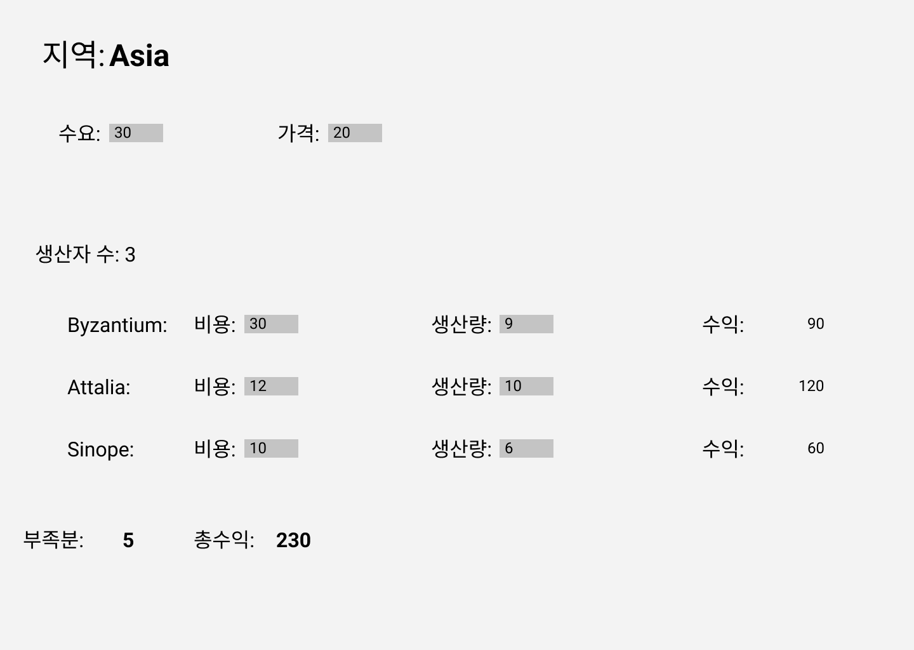

# 4. 테스트 구축하기

## 1. 자가 테스트 코드의 가치


> 리팩터링은 분명 가치 있는 도구지만, 그것만으로는 부족하다. 리팩터링을 제대로 하려면 불가피하게 저지르는 실수를 잡나주는 견고한 테스트 스위트가 뒷받침돼야한다.

 프로그래밍을 하다보면 실제로 코드를 작성하는 시간의 비중은 그리 크지 않다. 현재 상황을 파악하기도 하고, 설계를 고민하기도 한다. 또 버그 수정이 시간이 오래 걸리는 과정 중 하나인데 물론 이 버그 수정에서 직접적으로 코드를 고치는 시간은 길지 않다. 가장 오래걸리는 시간은 바로 버그를 찾는 시간이다. 때문에 테스트 코드가 중요한 것이다.

 테스트를 작성하려면 소프트웨어 제품 본체 외의 부가적인 코드를 상당량 작성해야 한다. 그래서 테스트가 실제로 프로그래밍 속도를 높여주는 경험을 직접 해보지 않고서는 자가 테스트의 진가를 납득하긴 어려울 것이다. 하지만 이 역시 하다보면 나아질 것이고 테스트가 자동화가 되면 재미도 높아질 것이다.

 테스트를 작성하기 가장 좋은 시점은 프로그래밍을 시작하기 전이다. 저자는 기능을 추가해야 할 때 테스트부터 작성한다. 테스트를 작성하다보면 기능을 추가하기 위해 무엇이 필요한지 고민하게 된다. 구현보다 인터페이스에 집중하게 된다는 장점도 있다. 게다가 코딩이 완료되는 시점을 정확하게 판단할 수 있다. 테스트를 모두 통과한 시점이 바로 코드를 완성한 시점이다.


## 2. 테스트할 샘플 코드



**기능 목록**

- 생산 계획: 지역, 수요, 가격

- 생산자: 특정 가격으로 특정 수량만큼 생산가능, UI는 생산자별로 제품을 모두 판매 했을 떄 얻을 수 있는 수익도 보여준다.


Data

```js
function sampleProvinceData(){
	return {
		name: "Asia",
		producers:[
			{name: "Byzantium",	cost: 10,	production: 9},
			{name: "Attalia",		cost: 12, production: 10},
			{name:	"Sinope",		cost: 10, production: 6},
		],
		demand: 30,
		price: 20
	};
}
```


Producer	-> 생산자 클래스

```js
class Producer{
  constructor(aProvince, data){
    this._province = aProvince;
    this._cost = data.cost;
    this._name = data.name;
    this._production = data.production || 0;
  }
  
  get name() 	{return this._name;}
  get cost()	{return this._cost;}
  set cost(arg)	{this._cost = parseInt(arg);}
  
  get production() {return this._production;}
  set production(amountStr) {
    const amount = parseInt(amountStr);
    const newProduction = Number.isNaN(amount) ? 0 : amount;
    this._province.totalProduction += newProduction - this.production;
    this._production = newProduction
  }
}
```


Province	-> 지역 전체

```js
class Province {
  constructor(doc) {
    this._name = doc.name;
    this._producer = [];
    this._totalProduction = 0;
    this._demand = doc.demand;
    this._price = doc.price;
    doc.producers.forEach((d) => this.addProducer(new Producer(this, d)));
  }

  get name() {
    return this._name;
  }
  get producers() {
    return this._producer.slice();
  }
  get totalProduction() {
    return this._totalProduction;
  }
  set totalProduction(arg) {
    this._totalProduction = arg;
  }
  get demand() {
    return this._demand;
  }
  set demand(arg) {
    this._demand = parseInt(arg);
  }
  get price() {
    return this._price;
  }
  set price(arg) {
    this._price = parseInt(arg);
  }

  addProducer(arg) {
    this._producer.push(arg);
    this._totalProduction += arg.production;
  }

  // 생산 부족분 계산
  get shortfall() {
    return this._demand - this.totalProduction;
  }

  // 수익 계산
  get profit() {
    return this.demandValue - this.demandCost;
  }

  get demandValue() {
    return this.satisfiedDemand * this.price;
  }
  get satisfiedDemand() {
    return Math.min(this._demand, this.totalProduction);
  }

  get demandCost() {
    let remainingDemand = this.demand;
    let result = 0;
    this.producers
      .sort((a, b) => a.cost - b.cost)
      .forEach((p) => {
        const contribution = Math.min(remainingDemand, p.production);
        remainingDemand -= contribution;
        result += contribution * p.cost;
      });

    return result;
  }
}

```


## 3. 첫 번째 테스트

책에서는 모카 프레임워크를 사용했지만 테스트코드를 연습할겸 jest를 사용하였다. 모카와 jest의 차이점은 아래 링크를 참조하면 좋을 것 같다.

[모카 vs jest](https://www.merixstudio.com/blog/mocha-vs-jest/)

우선 생산 부족분을 제대로 계산하는지 확인 해보자

```js
describe("province", () => {
  test("shortfall", () => {
    const asia = new Province(sampleProvinceData());
    expect(asia.shortfall).toBe(5);
  });
});
```


>  **실패해야 할 상황에서는 반드시 실패하게 만들자!** 


기존 코드를 검증하는 테스트를 작성했고 모두 통과했다는 건 좋은 일이다. 하지만 테스트가 실패하는 모습을 최소한 한 번씩은 확인해봐야 한다.

```js
get shortfall(){
	return this._demand - this.totalProduction * 2;  오류 주입
}
```

실행을 해보면 오류가 나타난다.

  Expected: 5
    Received: -20

       5 |   test("shortfall", () => {
       6 |     const asia = new Province(sampleProvinceData());
    >  7 |     expect(asia.shortfall).toBe(5);
         |                            ^
       8 |   });
       9 | });


테스트 프레임워크에서는 어느 테스트가 실패했고 실패 원인을 추론해볼 수 있는 단서까지 제공해준다.

> **자주 테스트하라. 작성중인 코드는 최소한 몇 분 간격으로 테스트하고 적어도 하루에 한 번은 전체 테스트를 돌려보자.**


만일 실패한 테스트가 하나라도 있으면 리팩터링하면 안된다. 리팩터링을 진행했을 때 빨간 막대가 나온다면 이전 체크포인트로 돌아가는 것을 추천한다.


## 4. 테스트 추가하기

 이제 각각의 테스트를 더 추가해볼 것이다. **테스트는 위험 요인을 중심으로 작성해야한다!!** 테스트의 목적은 어디까지나 현재 혹은 향후에 발생하는 버그를 찾는 데 있다. 단순히 필드를 읽고 쓰기만 하는 접근자는 테스트할 필요가 없다.

> 완벽하게 만드느라 테스트를 수행하지 못하느니, 불완전한 테스트라도 작성해 실행하는 게 낫다.

```js
describe("province", () => {
  const asia = new Province(sampleProvinceData());

  test("shortfall", () => {
    expect(asia.shortfall).toBe(5);
  });

  test("profit", () => {
    expect(asia.profit).toBe(230);
  });
});
```

 위와 같은 테스트 코드를 살펴보자 테스트 관련 버그 중 가장 지저분한 유형인 '테스트끼리 상호작용하게 하는 공유 픽스처(asia)'가 존재한다. 만일 다른 테스트에서 이 공유 객체의 값을 수정하면 이 픽스처를 사용하는 또 다른 테스트가 실패할 수 있다.


```js
describe("province", () => {
  let asia;
  beforeEach(() => {
    asia = new Province(sampleProvinceData());
  });
  test("shortfall", () => {
    expect(asia.shortfall).toBe(5);
  });

  test("profit", () => {
    expect(asia.profit).toBe(230);
  });
});
```

 beforEach구문을 활용하여 개별 테스트를 실행할 때마다 픽스처를 새로 만들어야 한다. 이를 통해 모든 테스트를 독립적으로 구성할 수 있게 된다. 불변임이 확실한 픽스처는 공유하기도 하지만 가장 좋은 방식은 매번 새로운 픽스처를 만드는 것이다.


## 4.5 픽스처 수정하기

```js
  test("change production", () => {
    asia.producers[0].production = 20; // 수행
    expect(asia.shortfall).toBe(-6);	// 검증
    expect(asia.profit).toBe(292);		// 검증
  });
```

beforeEach블록에서 '설정'한 표준 픽스처를 취해서, 테스트를 '수행'하고 이 픽스처가 일을 기대한 대로 처리했는지를 '검증'한다. 이패턴을 설정-실행-검증(setup-exercise-verify), 조건-발생-결과(given-when-then), 준비-수행-단언(arrange-act-assert)등으로 부른다. 이 세 가지 단계가 한 테스트 안에 모두 담겨있을 수도 있고, 초기 준비 작업 중 공통되는 부분을 beforeEach와 같은 표준 설정 루틴에 모아서 처리하기도 한다.


위의 test에서는 두가지를 검증하고 있는데 일반적으로 test구문 하나당 하나씩만 검증하는 것이 좋다. 만일 앞쪽 검증이 실패하면 두번째 검증은 실행해보지도 못하고 실패하게 되기 때문이다.


## 4.6 경계 조건 검사하기

 지금까지 작성 테스트는 모두 의도대로 사용하는 '꽃길 상황'이다. 이 범위를 벗어나는 경계 지점에서 문제가 생기면 어떤일이 벌어지는지 확인하는 테스트도 함께 작성하면 좋다.

```js
  test("negative demand", () => {
    asia.demand = -1;
    expect(asia.shortfall).toBe(-26);
    expect(asia.profit).toBe(-10);
  });
```

음수를 테스트하는 경우이다. 만약 수요가 음수일 때 수익이 음수가 나온다는 것이 이 프로그램을 사용하는 고객 관점에서 말이 되는 소리일까? 수요의 최솟값은 0이어야 하지 않나? 만약 수요에 전달된 인수가 음수라면 에러를 던지거나 무조건 0으로 설정해야하지 않을까?

 이처럼 경계를 확인하는 테스트를 작성해보면 프로그램에서 이런 특이 상황을 어떻게 처리하는 게 좋을지 생각해볼 수 있다.

> 문제가 생길 가능성이 잇는 경계 조건을 생각해보고 그 부분을 집중적으로 테스트하자.


**실패**란 검증 단계에서 실제 값이 예상 범위를 벗어났다는 뜻이다.

**에러**란 검증보다 앞선 과정에서 발생한 예외 상황을 말한다.

그렇다면 프로그램은 이 에러에 관해서 어떻게 대처해야 할까? 입력 객체를 신뢰할 수 있는 곳에서 만들어주는 경우는 모듈 사이에 유효성 검사코드가 너무 많아지게 되고 이는 다른 곳에서 확인한 걸 중복으로 검증하여 오히려 문제가 될 수 있다. 반면 JSON으로 인코딩된 요청처럼 외부에서 들어온 입력 개체는 유효한지 확인해야 한다.


> 어차피 모든 버그를 잡아낼 수는 없다고 생각하여 테스트를 작성하지 않는다면 대다수의 버그를 잡을 수 있는 기회를 날리는 셈이다.

**그렇다면 테스트를 어느 수준까지 해야할까?**

 아무리 테스트해도 버그 없는 완벽한 프로그램을 만들수는 없다. 그럼에도 테스트는 프로그래밍 속도를 높여준다. 테스트를 너무 많이 작성하다 보면 오히려 의욕이 떨어져 나중에는 하나도 작성하지 않게 된다. 따라서 위험한 부분에 집중하는 것이 좋다. 코드에서 처리 과정이 복잡한 부분, 오류가 생길 부분에 집중하자!! **테스트가 모든 버그를 걸러주지는 못할지라도, 안심하고 리팩터링할 수 있는 보호막은 되어준다.**

 실력이 굉장히 뛰어나거나 운이 아주 좋지 않는 한, 한 번에 완벽한 테스트를 갖출 순 없다. 나는 제품 코드에 못지않게 테스트 스위트도 지속해서 보강한다.


> 버그 리포트를 받으면 가장 먼저 그 버그를 드러내는 단위 테스트부터 작성하자.

 해당 버그를 픽스하기 위해서는 확인할 수 있는 테스트가 우선이다.


 테스트 스위트가 충분한지를 평가하는 기준은 주관적이다. 가령 '누군가 결함을 심으면 테스트가 발견할 수 있다는 믿음'을 기준으로 할 수 있다. 자가 테스트 모드의 목적은 이 믿음을 갖게 해주는 것이다. 리팩터링 후 테스트 결과가 모두 초록색인 것만 보고도 리팩터링 과정에서 생겨난 버그가 하나도 없다고 확신할 수 있다면 충분히 좋은 테스트 스위트라 할 수 있다.

